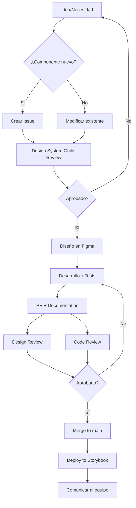

# 🧬 Bioma 2.0 Design System
## Documentación Maestra

**Versión:** 2.0
**Última actualización:** Febrero 2026
**Estado:** En migración activa

---

## Índice General

### [1. Introducción y Guías](#1-introducción-y-guías)
- [1.1 Bienvenida a Bioma 2.0](#11-bienvenida-a-bioma-20)
- [1.2 Primeros Pasos](#12-primeros-pasos)
- [1.3 Estado del Sistema](#13-estado-del-sistema)

### [2. Foundations (Fundamentos)](#2-foundations-fundamentos)
- [2.1 Color](#21-color)
- [2.2 Typography](#22-typography)
- [2.3 Spacing](#23-spacing)
- [2.4 Sizing](#24-sizing)
- [2.5 Radius](#25-radius)
- [2.6 Shadows](#26-shadows)
- [2.7 Grid & Layout](#27-grid--layout)
- [2.8 Iconografía](#28-iconografía)

### [3. Components (Componentes)](#3-components-componentes)
- [3.1 Forms](#31-forms)
- [3.2 Actions](#32-actions)
- [3.3 Feedback](#33-feedback)
- [3.4 Navigation](#34-navigation)
- [3.5 Data Display](#35-data-display)
- [3.6 Overlays](#36-overlays)
- [3.7 Primitives](#37-primitives)
- [3.8 Specialized](#38-specialized)

### [4. Patterns](#4-patterns)
### [5. Guías Técnicas](#5-guías-técnicas)
### [6. Recursos](#6-recursos)

---

# 1. Introducción y Guías

## 1.1 Bienvenida a Bioma 2.0

### ¿Qué es Bioma?

Bioma es el sistema de diseño oficial que proporciona los componentes, patrones y directrices necesarios para crear experiencias consistentes, accesibles y escalables. Este sistema unifica diseño y desarrollo mediante una nomenclatura compartida y tokens sincronizados.

### Filosofía del Sistema

Bioma se construye sobre cuatro principios fundamentales:

**1. Configuración sobre Customización**
En lugar de crear múltiples componentes para cada caso de uso, Bioma ofrece componentes altamente configurables a través de propiedades. Un único componente `Input` con diferentes props reemplaza a múltiples variantes específicas.

**2. Paridad Figma ↔ Código**
Cada componente en Figma tiene un equivalente exacto en código. Los nombres de propiedades, valores de variantes y estructura son idénticos, eliminando la fricción en el handoff.

**3. Accesibilidad por Diseño**
Todos los componentes cumplen con WCAG 2.1 AA como mínimo. La accesibilidad no es un añadido, es un requisito fundamental desde el diseño inicial.

**4. Escalabilidad y Mantenibilidad**
El sistema está diseñado para crecer sin fragmentación. Una arquitectura de tokens de dos niveles (Foundation + Semantic) permite agregar temas, variantes y componentes sin refactorización mayor.

### Audiencias

Esta documentación está diseñada para tres audiencias principales:

**👨‍🎨 Diseñadores**
- Cómo usar componentes en Figma
- Guías de uso y mejores prácticas
- Construcción de nuevos componentes
- Proceso de contribución

**👨‍💻 Desarrolladores**
- Implementación en Angular + Bootstrap
- API de componentes y props
- Ejemplos de código
- Integración y configuración

**📊 Product Managers**
- Capacidades del sistema
- Estado de componentes
- Roadmap y prioridades
- Criterios de adopción

### Cómo Usar Esta Documentación

**Para encontrar un componente:**
Navega a la sección [3. Components](#3-components-componentes) y usa el índice por categoría (Forms, Actions, Feedback, etc.)

**Para entender los fundamentos:**
Comienza por [2. Foundations](#2-foundations-fundamentos) para comprender el sistema de tokens, colores, tipografía y espaciado.

**Para implementar en código:**
Cada componente incluye una sección "Code Implementation" con ejemplos específicos de Angular.

**Para contribuir:**
Revisa [5. Guías Técnicas](#5-guías-técnicas) para estándares de nomenclatura, convenciones y proceso de migración.

---

## 1.2 Primeros Pasos

### Para Diseñadores

#### 1. Acceso a Figma

Las librerías de Bioma 2.0 están organizadas en:

```
📁 Bioma 2.0
├── 📚 Foundations
│   ├── Colors (Variables)
│   ├── Typography (Text Styles)
│   ├── Effects (Shadows)
│   └── Icons
├── 📚 Components
│   ├── Forms
│   ├── Actions
│   ├── Feedback
│   ├── Navigation
│   └── Data Display
└── 📚 Patterns
```

**Cómo habilitar las librerías:**
1. Abre tu archivo de Figma
2. Ve a Assets (Shift + I)
3. Busca "Bioma 2.0"
4. Habilita las librerías necesarias

#### 2. Uso de Componentes

Todos los componentes de Bioma siguen una estructura consistente:

**Nomenclatura de Propiedades:**
- `size`: Tamaño del componente (xs, sm, md, lg, xl)
- `state`: Estado de interacción (default, hover, focus, active, disabled)
- `variant`: Variante visual (filled, outlined, ghost, etc.)
- `show*`: Booleanos de visibilidad (showLabel, showIcon)
- `has*`: Booleanos de presencia (hasError, hasIconStart)
- `is*`: Booleanos de estado (isLoading, isSelected)

**Ejemplo: Configurar un Input**
1. Arrastra el componente `Forms/Input` al canvas
2. En el panel de propiedades, configura:
   - `size`: md
   - `state`: default
   - `variant`: outline
   - `showLabel`: true
   - `hasIconStart`: true
3. Edita los textos:
   - `label`: "Email"
   - `placeholder`: "tu@email.com"
4. Si necesitas un ícono, usa `iconStart` (Instance Swap)

#### 3. Variables y Tokens

**Usar tokens de color:**
En lugar de valores hex hardcodeados, siempre usa variables:
- Texto: `text/primary`, `text/secondary`, `text/muted`
- Fondos: `bg/primary`, `bg/secondary`, `bg/brand`
- Bordes: `border/primary`, `border/focus`, `border/strong`

**Cambiar entre Light/Dark:**
Las variables semánticas se adaptan automáticamente al modo seleccionado en la colección `semantic/color`.

---

### Para Desarrolladores

#### 1. Instalación y Setup

**Requisitos:**
- Angular 15+
- Bootstrap 5.3+
- Node 18+

**Instalación del paquete Bioma:**

```bash
# NPM
npm install @mgomezw/bioma

# Yarn
yarn add @mgomezw/bioma
```

**Configuración en Angular:**

```typescript
// app.module.ts
import { BiomaModule } from '@mgomezw/bioma';

@NgModule({
  imports: [
    BiomaModule,
    // ... otros módulos
  ]
})
export class AppModule { }
```

**Importar estilos:**

```scss
// styles.scss

// 1. Importar tokens de Bioma
@import '@mgomezw/bioma/tokens';

// 2. Override de variables Bootstrap (opcional)
@import 'bootstrap-overrides';

// 3. Importar Bootstrap
@import 'bootstrap/scss/bootstrap';

// 4. Importar componentes Bioma
@import '@mgomezw/bioma/components';
```

#### 2. Configuración de Temas (Light/Dark)

**Crear Theme Service:**

```typescript
// services/theme.service.ts
import { Injectable, signal } from '@angular/core';

@Injectable({ providedIn: 'root' })
export class ThemeService {
  private currentTheme = signal<'light' | 'dark'>('light');

  constructor() {
    // Detectar preferencia del sistema
    const prefersDark = window.matchMedia('(prefers-color-scheme: dark)').matches;
    const savedTheme = localStorage.getItem('theme') as 'light' | 'dark';

    this.setTheme(savedTheme || (prefersDark ? 'dark' : 'light'));
  }

  setTheme(theme: 'light' | 'dark') {
    this.currentTheme.set(theme);
    document.documentElement.setAttribute('data-theme', theme);
    localStorage.setItem('theme', theme);
  }

  toggleTheme() {
    const newTheme = this.currentTheme() === 'light' ? 'dark' : 'light';
    this.setTheme(newTheme);
  }

  getCurrentTheme() {
    return this.currentTheme();
  }
}
```

**Aplicar en el componente raíz:**

```html
<!-- app.component.html -->
<div [attr.data-theme]="themeService.getCurrentTheme()">
  <router-outlet></router-outlet>
</div>
```

#### 3. Uso de Componentes

**Ejemplo: Button**

```typescript
// component.ts
import { Component } from '@angular/core';

@Component({
  selector: 'app-example',
  template: `
    <bio-button
      size="md"
      variant="filled"
      color="primary"
      [hasIconStart]="true"
      [isLoading]="isSubmitting"
      (click)="handleSubmit()"
    >
      <bio-icon iconStart name="send"></bio-icon>
      Enviar
    </bio-button>
  `
})
export class ExampleComponent {
  isSubmitting = false;

  handleSubmit() {
    this.isSubmitting = true;
    // ... lógica de envío
  }
}
```

#### 4. Override de Variables Bootstrap

```scss
// _bootstrap-overrides.scss

// Colors
$primary: var(--primary-default);
$danger: var(--danger-default);
$success: var(--success-default);
$warning: var(--warning-default);
$info: var(--info-default);

// Grays
$gray-100: var(--gray-100);
$gray-200: var(--gray-200);
$gray-300: var(--gray-300);
$gray-400: var(--gray-400);
$gray-500: var(--gray-500);
$gray-600: var(--gray-600);
$gray-700: var(--gray-700);
$gray-800: var(--gray-800);
$gray-900: var(--gray-900);

// Spacing
$spacer: 1rem; // 16px base
$spacers: (
  0: 0,
  1: var(--spacing-4),   // 4px
  2: var(--spacing-8),   // 8px
  3: var(--spacing-16),  // 16px
  4: var(--spacing-24),  // 24px
  5: var(--spacing-48),  // 48px
);

// Border
$border-width: var(--border-width-thin);
$border-radius: var(--radius-md);
$border-radius-sm: var(--radius-sm);
$border-radius-lg: var(--radius-lg);

// Typography
$font-family-base: var(--font-family-body);
$font-size-base: var(--font-size-body-md);
$line-height-base: var(--line-height-body-md);
```

---

## 1.3 Estado del Sistema

### Versión Actual: Bioma 2.0

**Estado de la migración:**
- ✅ Nomenclatura español → inglés: **Completada**
- ✅ Tokens Foundation: **Migrados**
- 🚧 Arquitectura de 2 niveles (Foundation + Semantic): **En implementación**
- 🚧 Componentes con nueva nomenclatura: **En proceso**
- ❌ Sincronización Figma ↔ Angular: **Pendiente**

### Roadmap de Migración 2.0 → 3.0

#### Sprint 1 (Semana 1-2): Críticos ⚡

**Componentes Alta Prioridad:**
- 🔴 **Input** - Consolidar fragmentos en componente único
- 🔴 **Button** - Ajustar paddings y espaciados
- 🔴 **Alert** - Revisar construcción y medidas
- 🔴 **Card** - Incorporar concepto de slots
- 🔴 **DataTable** - Componente en construcción activa
- 🔴 **Modal** - Revisar construcción y medidas

**Foundations:**
- Implementar arquitectura de tokens de 2 niveles
- Completar colecciones faltantes
- Sincronizar Assets (Iconos, Ilustraciones, Logos)

#### Sprint 2 (Semana 3-4): Forms Core 📝

- Textarea
- Select/Dropdown
- Checkbox
- Radio
- Switch
- Badge
- Chip

#### Sprint 3 (Semana 5-6): Feedback & Navigation 🎯

- Toast
- Tag
- Pill
- Spinner
- Tabs
- Pagination
- Stepper
- Sidebar
- Header
- Footer
- Accordion

#### Sprint 4 (Semana 7-8): Completar Sistema 🏁

- FileUploader
- Counter
- Progress
- Tooltip
- Coachmark
- Empty/Error States
- Breadcrumb
- Divider
- Charts
- Maps
- Drawer
- Popover

### Componentes por Estado

| Estado | Descripción | Componentes |
|--------|-------------|-------------|
| ✅ **Publicado** | Listo para usar, verificar nomenclatura | Button, Checkbox, Radio, Switch, Icon, Logo |
| 🚧 **En Proceso** | En construcción activa | DataTable, FileUploader, Progress, Drawer, Charts |
| ⚠️ **Requiere Ajuste** | Publicado pero necesita mejoras | Input, Alert, Card, Modal, Slider, Chip, Accordion |

### Deuda Técnica Conocida

**Foundations:**
- ❌ Falta arquitectura de tokens de 2 niveles completa
- ❌ Inconsistencias en nomenclatura de spacing
- ❌ Variables de shadow aún no soportadas nativamente en Figma

**Componentes:**
- ❌ Presencia de componentes locales en exceso ("librerías de librerías")
- ❌ Duplicación de esfuerzos en creación y mantenimiento
- ❌ Props con IDs de Figma en componentes antiguos

**Documentación:**
- ❌ Desfase entre Diseño, Desarrollo y Documentación
- ❌ Ausencia de documento formal de Handoff/Ready to Dev

---

# 2. Foundations (Fundamentos)

Los Foundations son los bloques de construcción más básicos del sistema. Definen los valores primitivos (colores, espaciados, tipografía) y los tokens semánticos que usan los componentes.

---

## 2.1 Color

### Overview

El sistema de color de Bioma está diseñado para ser flexible, accesible y escalable. Utiliza una arquitectura de **dos niveles** (Foundation + Semantic) que permite cambiar temas sin modificar componentes.

**Principios de Color:**
1. **Accesibilidad primero**: Todos los colores cumplen WCAG 2.1 AA (contraste mínimo 4.5:1)
2. **Consistencia semántica**: Los tokens tienen significado (primary, danger, success)
3. **Theming automático**: Light/Dark mode sin código adicional
4. **Escalabilidad**: Agregar paletas o temas no requiere refactorización

### Arquitectura de Color

```
┌─────────────────────────────────────────┐
│  NIVEL 1: FOUNDATION                   │
│  Variables primitivas (valores absolutos) │
│  No cambian entre temas                 │
└─────────────────────────────────────────┘
              ↓ referencia
┌─────────────────────────────────────────┐
│  NIVEL 2: SEMANTIC                     │
│  Tokens contextuales (aliases)          │
│  Cambian según modo Light/Dark          │
└─────────────────────────────────────────┘
```

---

### Foundation Colors (Nivel 1)

Valores absolutos RGB que **nunca cambian**. Son la fuente de verdad del sistema.

#### Paleta: Neutral

**Uso:** Texto, fondos, bordes neutros

| Token | Valor RGB | Hex | Uso Principal |
|-------|-----------|-----|---------------|
| `neutral/50` | rgb(250, 250, 250) | #FAFAFA | Fondos muy claros |
| `neutral/100` | rgb(245, 245, 242) | #F5F5F2 | Fondos claros |
| `neutral/200` | rgb(227, 227, 227) | #E3E3E3 | Bordes sutiles |
| `neutral/300` | rgb(194, 194, 191) | #C2C2BF | Bordes medios |
| `neutral/400` | rgb(150, 150, 150) | #969696 | Texto deshabilitado |
| `neutral/500` | rgb(115, 115, 115) | #737373 | Texto secundario |
| `neutral/600` | rgb(87, 84, 84) | #575454 | Texto secundario fuerte |
| `neutral/700` | rgb(64, 64, 64) | #404040 | Texto primario |
| `neutral/800` | rgb(48, 48, 46) | #30302E | Texto fuerte |
| `neutral/900` | rgb(38, 38, 38) | #262626 | Texto muy fuerte |
| `neutral/950` | rgb(18, 18, 18) | #121212 | Fondos dark mode |
| `neutral/white` | rgb(255, 255, 255) | #FFFFFF | Blanco puro |
| `neutral/black` | rgb(0, 0, 0) | #000000 | Negro puro |

#### Paleta: Gray

**Uso:** Superficies, divisores, estados neutros

| Token | Valor RGB | Hex |
|-------|-----------|-----|
| `gray/50` | rgb(242, 242, 245) | #F2F2F5 |
| `gray/100` | rgb(227, 232, 237) | #E3E8ED |
| `gray/200` | rgb(204, 214, 222) | #CCD6DE |
| `gray/300` | rgb(163, 176, 189) | #A3B0BD |
| `gray/400` | rgb(138, 153, 171) | #8A99AB |
| `gray/500` | rgb(112, 135, 158) | #70879E |
| `gray/600` | rgb(99, 120, 140) | #63788C |
| `gray/700` | rgb(64, 79, 97) | #404F61 |
| `gray/800` | rgb(48, 59, 71) | #303B47 |
| `gray/900` | rgb(33, 38, 41) | #212629 |
| `gray/950` | rgb(23, 23, 28) | #17171C |

#### Paleta: Brand (Rojo característico)

**Uso:** Identidad de marca, acciones primarias

| Token | Valor RGB | Hex | Uso |
|-------|-----------|-----|-----|
| `brand/50` | rgb(255, 237, 237) | #FFEDED | Fondo muy sutil |
| `brand/100` | rgb(255, 209, 212) | #FFD1D4 | Fondo sutil |
| `brand/200` | rgb(255, 163, 171) | #FFA3AB | Fondo medio |
| `brand/300` | rgb(255, 77, 97) | #FF4D61 | Texto sobre claro |
| `brand/400` | rgb(245, 43, 74) | #F52B4A | Hover light mode |
| `brand/500` | rgb(227, 0, 56) | #E30038 | ⭐ Brand principal |
| `brand/600` | rgb(196, 0, 48) | #C40030 | Pressed light mode |
| `brand/700` | rgb(186, 31, 56) | #BA1F38 | Strong |
| `brand/800` | rgb(156, 0, 36) | #9C0024 | Very strong |
| `brand/900` | rgb(112, 0, 23) | #700017 | Dark mode bg |
| `brand/950` | rgb(69, 0, 10) | #45000A | Dark mode strong |

#### Otras Paletas Foundation

**Cinnamon (Marrón cálido):**
- `cinnamon/100` a `cinnamon/900`
- Uso: Acentos secundarios, elementos cálidos

**Tamarillo (Rojo oscuro):**
- `tamarillo/100` a `tamarillo/900`
- Uso: Variante de brand, elementos de énfasis

**Vermillion (Naranja rojizo):**
- `vermillion/100` a `vermillion/900`
- Uso: Warnings, alertas cálidas

**Navy (Azul oscuro):**
- `navy/100` a `navy/900`
- Uso: Información, elementos fríos

**Cerulean (Azul medio):**
- `cerulean/100` a `cerulean/900`
- Uso: Links, información, focus states

**Viridian (Verde azulado):**
- `viridian/100` a `viridian/900`
- Uso: Success, confirmaciones

**Saffron (Amarillo dorado):**
- `saffron/100` a `saffron/950`
- Uso: Warnings suaves, atención

**System Colors (Estados):**
- `system/pink`: rgb(232, 117, 245) - #E875F5
- `system/purple`: rgb(117, 128, 245) - #7580F5
- `system/tangerine`: rgb(255, 163, 77) - #FFA34D
- `system/cardinal`: rgb(255, 84, 97) - #FF5461
- `system/moss`: rgb(161, 217, 153) - #A1D999

---

### Semantic Colors (Nivel 2)

Tokens contextuales que **referencian** a Foundation y **cambian** según el modo Light/Dark.

#### Text (Jerarquía de texto)

**Propósito:** Crear jerarquía visual clara en contenido de texto

| Token | Light Mode | Dark Mode | Uso |
|-------|------------|-----------|-----|
| `text/strong` | `{gray/950}` | `{neutral/white}` | Títulos, énfasis máximo |
| `text/primary` | `{gray/800}` | `{gray/50}` | Texto de cuerpo principal |
| `text/secondary` | `{gray/700}` | `{gray/100}` | Texto secundario |
| `text/tertiary` | `{gray/600}` | `{gray/200}` | Texto terciario, metadatos |
| `text/muted` | `{gray/500}` | `{gray/400}` | Texto atenuado, placeholders |
| `text/disabled` | `{gray/300}` | `{gray/500}` | Texto deshabilitado |
| `text/inverse` | `{neutral/white}` | `{gray/950}` | Texto sobre fondos oscuros/claros |
| `text/link` | `{cerulean/600}` | `{cerulean/200}` | Enlaces, acciones de texto |

**Ejemplo de uso:**

```scss
.heading {
  color: var(--text-strong);
}

.body-text {
  color: var(--text-primary);
}

.label {
  color: var(--text-secondary);
}

.placeholder {
  color: var(--text-muted);
}
```

#### Background (Fondos)

| Token | Light Mode | Dark Mode | Uso |
|-------|------------|-----------|-----|
| `bg/primary` | `{neutral/white}` | `{neutral/black}` | Fondo principal |
| `bg/secondary` | `{gray/50}` | `{gray/900}` | Fondo secundario |
| `bg/tertiary` | `{gray/100}` | `{gray/800}` | Fondo terciario |
| `bg/inverse` | `{neutral/black}` | `{neutral/white}` | Fondo inverso |
| `bg/brand` | `{brand/500}` | `{brand/200}` | Fondo de marca |
| `bg/brand-hover` | `{brand/600}` | `{brand/300}` | Hover de marca |
| `bg/disabled` | `{gray/100}` | `{gray/800}` | Fondo deshabilitado |

#### Border (Bordes)

| Token | Light Mode | Dark Mode | Uso |
|-------|------------|-----------|-----|
| `border/subtle` | `{gray/50}` | `{gray/800}` | Bordes muy sutiles |
| `border/primary` | `{gray/100}` | `{gray/700}` | Bordes por defecto |
| `border/secondary` | `{gray/200}` | `{gray/600}` | Bordes más visibles |
| `border/tertiary` | `{gray/300}` | `{gray/500}` | Bordes medios |
| `border/strong` | `{gray/500}` | `{gray/300}` | Bordes fuertes |
| `border/heavy` | `{gray/800}` | `{gray/100}` | Bordes muy marcados |
| `border/focus` | `{cerulean/600}` | `{cerulean/300}` | Estado de foco (a11y) |

#### Primary (Color de marca)

| Token | Light Mode | Dark Mode | Uso |
|-------|------------|-----------|-----|
| `primary/subtle` | `{brand/50}` | `{brand/900}` | Fondo muy sutil |
| `primary/ghost` | `{brand/200}` | `{brand/800}` | Fondo ghost button |
| `primary/default` | `{brand/500}` | `{brand/300}` | ⭐ Default primary |
| `primary/hover` | `{brand/600}` | `{brand/200}` | Hover state |
| `primary/strong` | `{brand/700}` | `{brand/200}` | Pressed/active |

**Ejemplo de uso:**

```scss
.btn-primary {
  background-color: var(--primary-default);
  color: var(--text-inverse);

  &:hover {
    background-color: var(--primary-hover);
  }

  &:active {
    background-color: var(--primary-strong);
  }
}

.btn-ghost {
  background-color: var(--primary-ghost);
  color: var(--primary-default);
}
```

#### Status Colors (Estados del sistema)

**Danger (Error / Destructivo):**

| Token | Light Mode | Dark Mode | Uso |
|-------|------------|-----------|-----|
| `danger/subtle` | `{brand/50}` | `{system-red/800}` | Fondo de alerta error |
| `danger/default` | `{system-red/500}` | `{system-red/400}` | Texto/icono error |
| `danger/strong` | `{system-red/600}` | `{system-red/300}` | Error fuerte |

**Warning (Advertencia):**

| Token | Light Mode | Dark Mode |
|-------|------------|-----------|
| `warning/subtle` | `{saffron/100}` | `{system-yellow/800}` |
| `warning/default` | `{vermillion/600}` | `{system-yellow/500}` |
| `warning/strong` | `{vermillion/700}` | `{system-yellow/400}` |

**Success (Éxito):**

| Token | Light Mode | Dark Mode |
|-------|------------|-----------|
| `success/subtle` | `{system-green/100}` | `{system-green/800}` |
| `success/default` | `{system-green/500}` | `{system/moss}` |
| `success/strong` | `{system-green/600}` | `{system/moss}` |

**Info (Información):**

| Token | Light Mode | Dark Mode |
|-------|------------|-----------|
| `info/subtle` | `{cerulean/100}` | `{cerulean/800}` |
| `info/default` | `{cerulean/600}` | `{cerulean/300}` |
| `info/strong` | `{cerulean/700}` | `{cerulean/200}` |

#### Icon (Iconografía)

| Token | Light Mode | Dark Mode | Uso |
|-------|------------|-----------|-----|
| `icon/strong` | `{gray/950}` | `{neutral/white}` | Íconos de máxima jerarquía |
| `icon/primary` | `{gray/800}` | `{gray/100}` | Íconos principales |
| `icon/secondary` | `{gray/700}` | `{gray/300}` | Íconos secundarios |
| `icon/tertiary` | `{gray/600}` | `{gray/400}` | Íconos terciarios |
| `icon/muted` | `{gray/500}` | `{gray/500}` | Íconos atenuados |
| `icon/disabled` | `{gray/300}` | `{gray/600}` | Íconos deshabilitados |
| `icon/inverse` | `{neutral/white}` | `{gray/950}` | Íconos sobre fondos oscuros/claros |
| `icon/link` | `{cerulean/600}` | `{cerulean/300}` | Íconos interactivos |

---

### Uso en Código

#### Implementación CSS

```css
/* Foundation colors (valores fijos) */
:root {
  --neutral-50: rgb(250, 250, 250);
  --neutral-100: rgb(245, 245, 242);
  --gray-50: rgb(242, 242, 245);
  --brand-500: rgb(227, 0, 56);
  /* ... resto de foundation colors */
}

/* Semantic colors con theming */
[data-theme="light"] {
  --text-strong: var(--gray-950);
  --text-primary: var(--gray-800);
  --bg-primary: var(--neutral-white);
  --primary-default: var(--brand-500);
  --primary-hover: var(--brand-600);
}

[data-theme="dark"] {
  --text-strong: var(--neutral-white);
  --text-primary: var(--gray-50);
  --bg-primary: var(--neutral-black);
  --primary-default: var(--brand-300);
  --primary-hover: var(--brand-200);
}
```

#### Uso en Angular

```scss
// Usar semantic tokens, no foundation
.my-component {
  background-color: var(--bg-primary);
  color: var(--text-primary);
  border: 1px solid var(--border-primary);
}

.my-button {
  background-color: var(--primary-default);
  color: var(--text-inverse);

  &:hover {
    background-color: var(--primary-hover);
  }

  &:disabled {
    background-color: var(--bg-disabled);
    color: var(--text-disabled);
  }
}

.error-message {
  background-color: var(--danger-subtle);
  color: var(--danger-default);
  border-left: 3px solid var(--danger-strong);
}
```

#### TypeScript Definitions

```typescript
// types/colors.ts
export type ThemeMode = 'light' | 'dark';

export type SemanticColorToken =
  | 'text/strong' | 'text/primary' | 'text/secondary'
  | 'bg/primary' | 'bg/secondary'
  | 'border/primary' | 'border/focus'
  | 'primary/default' | 'primary/hover'
  | 'danger/default' | 'success/default' | 'warning/default' | 'info/default';

export interface ColorService {
  getColor(token: SemanticColorToken): string;
  setTheme(mode: ThemeMode): void;
  getCurrentTheme(): ThemeMode;
}
```

---

### Accesibilidad

#### Contraste WCAG 2.1

Todos los tokens semánticos garantizan un contraste mínimo de **4.5:1** para texto normal y **3:1** para texto grande (18px+).

**Combinaciones aprobadas:**

✅ `text/primary` sobre `bg/primary`: 14.7:1 (AAA)
✅ `text/secondary` sobre `bg/primary`: 9.8:1 (AAA)
✅ `text/muted` sobre `bg/primary`: 5.2:1 (AA)
✅ `primary/default` sobre `neutral/white`: 7.3:1 (AAA)
✅ `danger/default` sobre `danger/subtle`: 6.8:1 (AAA)

**Combinaciones NO aprobadas:**

❌ `text/disabled` sobre `bg/primary`: 2.9:1 (FAIL) - Solo para elementos no interactivos
❌ `primary/ghost` sobre `bg/primary`: 1.8:1 (FAIL) - Solo para backgrounds, no texto

#### Focus States

Todos los elementos interactivos deben usar `border/focus` para el estado de foco:

```scss
.interactive-element:focus-visible {
  outline: 2px solid var(--border-focus);
  outline-offset: 2px;
}
```

---

### Migración y Estado Actual

**✅ Completado:**
- Nomenclatura de todos los foundation colors
- Definición de semantic tokens principales

**🚧 En Proceso:**
- Implementación de arquitectura de 2 niveles en Figma Variables
- Conversión de componentes para usar semantic tokens
- Testing de contraste en todos los componentes

**❌ Pendiente:**
- Sincronización automática Figma → CSS
- Documentación completa de todos los tokens en Storybook
- Validación de accesibilidad automatizada

---

## 2.2 Tipografía

### Overview

La tipografía en Bioma 2.0 está diseñada para ofrecer una jerarquía clara, legibilidad óptima y consistencia en todos los productos. Utilizamos **Sora** como nuestra familia tipográfica principal tanto para encabezados como para texto de cuerpo, complementada con **Material Symbols Rounded** para iconografía.

**Principios clave:**
- **Escala modular**: Progresión clara y predecible de tamaños
- **Jerarquía visual**: Diferenciación clara entre niveles de importancia
- **Legibilidad**: Ratios de line-height optimizados para cada tamaño
- **Flexibilidad**: Sistema que funciona en interfaces densas y espaciadas

### Arquitectura de Tokens

La tipografía en Bioma usa una arquitectura de **Foundation Tokens** (valores primitivos) que se combinan para formar escalas tipográficas completas.

```
Foundation Tokens (Nivel 1)
├─ Font Families (3 tokens)
├─ Font Sizes (10 tokens: 6 headings + 4 body)
├─ Line Heights (10 tokens: 6 headings + 4 body)
├─ Font Weights (4 tokens)
└─ Letter Spacing (1 token)
```

**Nota sobre arquitectura**: En la futura versión 3.0, estos foundation tokens se combinarán en **Semantic Tokens** contextuales (ej: `typography/heading-1`, `typography/body-default`) para simplificar el consumo en componentes.

---

### Font Families (Familias Tipográficas)

#### Sora

Nuestra tipografía principal es **Sora**, una sans-serif geométrica moderna diseñada para interfaces digitales.

| Token | Valor | Uso |
|-------|-------|-----|
| `font-family/heading` | `"Sora", sans-serif` | Todos los encabezados (H1-H6) |
| `font-family/body` | `"Sora", sans-serif` | Todo el texto de cuerpo y UI |
| `font-family/icon` | `"Material Symbols Rounded"` | Sistema de iconografía |

**Características de Sora:**
- Geométrica y moderna
- Alta legibilidad en pantalla
- Amplio rango de pesos (300-800)
- Soporte multiidioma completo
- Optimizada para rendering digital

**Integración en proyecto:**

```html
<!-- Google Fonts CDN -->
<link rel="preconnect" href="https://fonts.googleapis.com">
<link rel="preconnect" href="https://fonts.gstatic.com" crossorigin>
<link href="https://fonts.googleapis.com/css2?family=Sora:wght@300;400;700;800&display=swap" rel="stylesheet">
<link href="https://fonts.googleapis.com/css2?family=Material+Symbols+Rounded:opsz,wght,FILL,GRAD@20..48,100..700,0..1,-50..200" rel="stylesheet">
```

```css
/* Definición de CSS Custom Properties */
:root {
  --font-family-heading: "Sora", -apple-system, BlinkMacSystemFont, "Segoe UI", sans-serif;
  --font-family-body: "Sora", -apple-system, BlinkMacSystemFont, "Segoe UI", sans-serif;
  --font-family-icon: "Material Symbols Rounded";
}
```

---

### Escala Tipográfica

#### Headings (Encabezados)

La escala de encabezados usa una progresión modular con ratios de ~1.15-1.2x entre niveles.

| Level | Token Size | Valor | Token Line-Height | Valor | Peso por Defecto | Uso Principal |
|-------|------------|-------|-------------------|-------|------------------|---------------|
| **H1** | `font-size/h1` | `42px` | `line-height/h1` | `56px` | Bold (700) | Hero titles, páginas principales |
| **H2** | `font-size/h2` | `36px` | `line-height/h2` | `44px` | Bold (700) | Secciones principales |
| **H3** | `font-size/h3` | `31px` | `line-height/h3` | `42px` | Bold (700) | Subsecciones importantes |
| **H4** | `font-size/h4` | `26px` | `line-height/h4` | `34px` | Bold (700) | Títulos de tarjetas, modales |
| **H5** | `font-size/h5` | `22px` | `line-height/h5` | `30px` | Bold (700) | Subtítulos, etiquetas destacadas |
| **H6** | `font-size/h6` | `19px` | `line-height/h6` | `26px` | Bold (700) | Encabezados menores |

**Ratios de line-height:**
- H1-H3: ~1.33x (más espacio para mejor legibilidad en tamaños grandes)
- H4-H6: ~1.3x (equilibrio entre compacto y legible)

#### Body Text (Texto de Cuerpo)

El texto de cuerpo tiene 4 tamaños para diferentes densidades de interfaz.

| Size | Token Size | Valor | Token Line-Height | Valor | Peso por Defecto | Uso Principal |
|------|------------|-------|-------------------|-------|------------------|---------------|
| **Large** | `font-size/body-lg` | `16px` | `line-height/body-lg` | `24px` | Regular (400) | Párrafos largos, contenido principal |
| **Medium** | `font-size/body-md` | `14px` | `line-height/body-md` | `21px` | Regular (400) | **Default** - Mayor parte de la UI |
| **Small** | `font-size/body-sm` | `12px` | `line-height/body-sm` | `18px` | Regular (400) | Etiquetas, metadata, texto secundario |
| **Extra Small** | `font-size/body-xs` | `10px` | `line-height/body-xs` | `15px` | Regular (400) | Badges, tooltips, texto terciario |

**Ratio de line-height: 1.5x** - Optimizado para legibilidad en textos extensos.

**⭐ Body Medium (14px)** es el tamaño por defecto para toda la interfaz.

---

### Font Weights (Pesos Tipográficos)

Bioma utiliza 4 pesos de Sora para crear jerarquía y énfasis.

| Token | Valor | Nombre | Uso Principal |
|-------|-------|--------|---------------|
| `font-weight/light` | `300` | Light | Textos decorativos, números grandes |
| `font-weight/regular` | `400` | **Regular** | **Default** - Todo el body text |
| `font-weight/bold` | `700` | Bold | Encabezados, énfasis, botones |
| `font-weight/extra-bold` | `800` | Extra Bold | Elementos de máxima jerarquía |

**Guías de uso:**

✅ **SÍ hacer:**
- Usar Regular (400) para todo el texto de cuerpo
- Usar Bold (700) para encabezados y botones
- Usar Light (300) solo en elementos decorativos o números grandes (>30px)
- Crear contraste con peso, no solo tamaño

❌ **NO hacer:**
- Usar Light (300) en texto pequeño (<16px) - dificulta legibilidad
- Mezclar más de 3 pesos en una misma vista
- Usar Extra Bold (800) en texto de cuerpo

---

### Letter Spacing

Bioma mantiene el espaciado de letras natural de la fuente Sora.

| Token | Valor | Uso |
|-------|-------|-----|
| `letter-spacing/default` | `0px` | Todo el texto (sin ajustes) |

**Razón**: Sora está optimizada para interfaces y no requiere ajustes de tracking. En versiones futuras se pueden añadir tokens específicos para casos especiales (ej: botones en uppercase).

---

### Uso en Código

#### Implementación CSS

```css
/* Foundation Typography Tokens */
:root {
  /* Font Families */
  --font-family-heading: "Sora", sans-serif;
  --font-family-body: "Sora", sans-serif;
  --font-family-icon: "Material Symbols Rounded";

  /* Font Sizes - Headings */
  --font-size-h1: 42px;
  --font-size-h2: 36px;
  --font-size-h3: 31px;
  --font-size-h4: 26px;
  --font-size-h5: 22px;
  --font-size-h6: 19px;

  /* Font Sizes - Body */
  --font-size-body-lg: 16px;
  --font-size-body-md: 14px;  /* Default */
  --font-size-body-sm: 12px;
  --font-size-body-xs: 10px;

  /* Line Heights - Headings */
  --line-height-h1: 56px;
  --line-height-h2: 44px;
  --line-height-h3: 42px;
  --line-height-h4: 34px;
  --line-height-h5: 30px;
  --line-height-h6: 26px;

  /* Line Heights - Body */
  --line-height-body-lg: 24px;
  --line-height-body-md: 21px;  /* Default */
  --line-height-body-sm: 18px;
  --line-height-body-xs: 15px;

  /* Font Weights */
  --font-weight-light: 300;
  --font-weight-regular: 400;  /* Default */
  --font-weight-bold: 700;
  --font-weight-extra-bold: 800;

  /* Letter Spacing */
  --letter-spacing-default: 0px;
}

/* Base body styles */
body {
  font-family: var(--font-family-body);
  font-size: var(--font-size-body-md);
  line-height: var(--line-height-body-md);
  font-weight: var(--font-weight-regular);
  letter-spacing: var(--letter-spacing-default);
}

/* Heading styles */
h1, .h1 {
  font-family: var(--font-family-heading);
  font-size: var(--font-size-h1);
  line-height: var(--line-height-h1);
  font-weight: var(--font-weight-bold);
}

h2, .h2 {
  font-size: var(--font-size-h2);
  line-height: var(--line-height-h2);
  font-weight: var(--font-weight-bold);
}

/* Utility classes */
.text-lg {
  font-size: var(--font-size-body-lg);
  line-height: var(--line-height-body-lg);
}

.text-sm {
  font-size: var(--font-size-body-sm);
  line-height: var(--line-height-body-sm);
}

.font-bold {
  font-weight: var(--font-weight-bold);
}
```

#### Uso en Angular / SCSS

```scss
// _typography.scss
@import 'tokens';

// Mixins para escalas tipográficas
@mixin heading-1 {
  font-family: var(--font-family-heading);
  font-size: var(--font-size-h1);
  line-height: var(--line-height-h1);
  font-weight: var(--font-weight-bold);
}

@mixin body-text {
  font-family: var(--font-family-body);
  font-size: var(--font-size-body-md);
  line-height: var(--line-height-body-md);
  font-weight: var(--font-weight-regular);
}

@mixin text-small {
  font-size: var(--font-size-body-sm);
  line-height: var(--line-height-body-sm);
}

// Uso en componentes
.card-title {
  @include heading-1;
  margin-bottom: 16px;
}

.card-description {
  @include body-text;
  color: var(--text-secondary);
}

.card-metadata {
  @include text-small;
  color: var(--text-muted);
}
```

#### TypeScript Definitions

```typescript
// types/typography.ts

export type FontFamily = 'heading' | 'body' | 'icon';

export type HeadingLevel = 'h1' | 'h2' | 'h3' | 'h4' | 'h5' | 'h6';

export type BodySize = 'lg' | 'md' | 'sm' | 'xs';

export type FontWeight = 'light' | 'regular' | 'bold' | 'extra-bold';

export interface TypographyToken {
  fontFamily: string;
  fontSize: string;
  lineHeight: string;
  fontWeight: number;
  letterSpacing: string;
}

export interface TypographyScale {
  headings: Record<HeadingLevel, TypographyToken>;
  body: Record<BodySize, TypographyToken>;
}

// Utility para construir estilos tipográficos
export class TypographyService {
  getHeadingStyles(level: HeadingLevel): TypographyToken {
    return {
      fontFamily: 'var(--font-family-heading)',
      fontSize: `var(--font-size-${level})`,
      lineHeight: `var(--line-height-${level})`,
      fontWeight: 700,
      letterSpacing: 'var(--letter-spacing-default)'
    };
  }

  getBodyStyles(size: BodySize = 'md'): TypographyToken {
    return {
      fontFamily: 'var(--font-family-body)',
      fontSize: `var(--font-size-body-${size})`,
      lineHeight: `var(--line-height-body-${size})`,
      fontWeight: 400,
      letterSpacing: 'var(--letter-spacing-default)'
    };
  }
}
```

#### Bootstrap Overrides

```scss
// _bootstrap-overrides.scss

// Sobrescribir variables de Bootstrap con tokens de Bioma
$font-family-base: var(--font-family-body);
$font-family-sans-serif: var(--font-family-body);

$font-size-base: var(--font-size-body-md);
$line-height-base: calc(var(--line-height-body-md) / var(--font-size-body-md));

$font-weight-lighter: var(--font-weight-light);
$font-weight-normal: var(--font-weight-regular);
$font-weight-bold: var(--font-weight-bold);
$font-weight-bolder: var(--font-weight-extra-bold);

// Headings
$h1-font-size: var(--font-size-h1);
$h2-font-size: var(--font-size-h2);
$h3-font-size: var(--font-size-h3);
$h4-font-size: var(--font-size-h4);
$h5-font-size: var(--font-size-h5);
$h6-font-size: var(--font-size-h6);

$headings-font-family: var(--font-family-heading);
$headings-font-weight: var(--font-weight-bold);
$headings-line-height: 1.3;

// Small text
$small-font-size: var(--font-size-body-sm);

// Display sizes (para heroes)
$display1-size: var(--font-size-h1);
$display1-weight: var(--font-weight-extra-bold);
```

---

### Patrones de Uso

#### Jerarquía Visual

**Ejemplo: Card con contenido estructurado**

```html
<div class="card">
  <h3 class="card-title">Título Principal</h3>
  <!-- H3 (31px/Bold) - Título de la tarjeta -->

  <p class="card-description">
    Este es el contenido principal de la tarjeta que explica
    de qué trata este elemento.
  </p>
  <!-- Body MD (14px/Regular) - Contenido principal -->

  <div class="card-metadata">
    <span>Última actualización: Hace 2 horas</span>
  </div>
  <!-- Body SM (12px/Regular) - Metadata secundaria -->
</div>
```

```scss
.card {
  &-title {
    font-size: var(--font-size-h3);
    line-height: var(--line-height-h3);
    font-weight: var(--font-weight-bold);
    color: var(--text-strong);
    margin-bottom: 12px;
  }

  &-description {
    font-size: var(--font-size-body-md);
    line-height: var(--line-height-body-md);
    color: var(--text-primary);
    margin-bottom: 16px;
  }

  &-metadata {
    font-size: var(--font-size-body-sm);
    line-height: var(--line-height-body-sm);
    color: var(--text-muted);
  }
}
```

#### Énfasis y Contraste

```html
<!-- Énfasis con peso, no solo tamaño -->
<p class="body-text">
  Este es un texto normal con
  <strong>énfasis en bold</strong>
  para resaltar información importante.
</p>

<!-- Combinación correcta de tamaño y peso -->
<div class="stat-display">
  <span class="stat-value">1,234</span>
  <span class="stat-label">Usuarios activos</span>
</div>
```

```scss
.body-text {
  font-size: var(--font-size-body-md);
  line-height: var(--line-height-body-md);
  color: var(--text-primary);

  strong {
    font-weight: var(--font-weight-bold);
    color: var(--text-strong);
  }
}

.stat-display {
  .stat-value {
    display: block;
    font-size: var(--font-size-h2);
    line-height: var(--line-height-h2);
    font-weight: var(--font-weight-light);  // Light en números grandes
    color: var(--text-strong);
  }

  .stat-label {
    display: block;
    font-size: var(--font-size-body-sm);
    line-height: var(--line-height-body-sm);
    font-weight: var(--font-weight-regular);
    color: var(--text-secondary);
  }
}
```

#### Iconos con Texto

```html
<button class="btn-with-icon">
  <span class="material-symbols-rounded">search</span>
  <span>Buscar</span>
</button>

<div class="list-item">
  <span class="material-symbols-rounded icon">check_circle</span>
  <span class="text">Tarea completada</span>
</div>
```

```scss
.btn-with-icon {
  display: flex;
  align-items: center;
  gap: 8px;
  font-family: var(--font-family-body);
  font-size: var(--font-size-body-md);
  font-weight: var(--font-weight-bold);

  .material-symbols-rounded {
    font-family: var(--font-family-icon);
    font-size: 20px;  // Icono ligeramente más grande que texto
  }
}

.list-item {
  display: flex;
  align-items: flex-start;
  gap: 12px;

  .icon {
    font-family: var(--font-family-icon);
    font-size: 24px;
    color: var(--icon-primary);
  }

  .text {
    font-size: var(--font-size-body-md);
    line-height: var(--line-height-body-md);
    color: var(--text-primary);
  }
}
```

---

### Accesibilidad

#### WCAG 2.1 Guidelines

**Tamaño mínimo de texto:**
- ✅ Texto normal: mínimo 14px (cumple Body MD)
- ✅ Texto grande: 18px+ o 14px Bold (cumple H6)
- ⚠️ Evitar Body XS (10px) para contenido esencial

**Line Height:**
- ✅ Mínimo recomendado: 1.5x para body text (cumple con 1.5x)
- ✅ Mínimo recomendado: 1.3x para headings (cumple con ~1.33x)

**Contraste con fondos:**
- Todos los tokens de tipografía deben combinarse con los tokens de color apropiados
- Ver sección **2.1 Color > Accesibilidad** para combinaciones aprobadas
- Siempre usar `text/primary` sobre `bg/primary` para máximo contraste

#### Focus Indicators

Los elementos con texto interactivo deben tener indicadores de foco claros:

```scss
.link-text,
.button-text {
  &:focus-visible {
    outline: 2px solid var(--border-focus);
    outline-offset: 2px;
    border-radius: 2px;
  }
}
```

#### Responsive Typography

Para mantener legibilidad en móviles, considera ajustar tamaños:

```scss
// Reducción sutil en mobile para headings grandes
@media (max-width: 768px) {
  h1, .h1 {
    font-size: calc(var(--font-size-h1) * 0.85);  // 42px → ~36px
    line-height: calc(var(--line-height-h1) * 0.85);
  }

  h2, .h2 {
    font-size: calc(var(--font-size-h2) * 0.9);  // 36px → ~32px
    line-height: calc(var(--line-height-h2) * 0.9);
  }

  // Body text se mantiene igual para legibilidad
}
```

**⚠️ Nota**: Los ajustes responsive deben ser sutiles. Nunca reducir body text por debajo de 14px en mobile.

---

### Migración y Estado Actual

**✅ Completado:**
- Definición de font families (Sora como tipografía principal)
- Escala completa de headings (H1-H6) con tamaños y line-heights
- Escala completa de body text (LG, MD, SM, XS)
- Definición de font weights (Light, Regular, Bold, Extra Bold)
- Implementación en Figma Variables como Foundation Tokens

**🚧 En Proceso:**
- Conversión de componentes para usar tokens tipográficos consistentemente
- Creación de Semantic Tokens para versión 3.0 (ej: `typography/heading-1`)
- Documentación completa en Storybook con ejemplos interactivos
- Testing de legibilidad en todos los breakpoints

**❌ Pendiente:**
- Implementación de responsive typography automática
- Tokens adicionales para casos especiales (buttons uppercase, números display)
- Guías de uso de Material Symbols (sizing, variants, optical sizing)
- Auditoría completa de todos los componentes para verificar uso correcto de tokens

**Migración desde versión anterior:**

Si estás migrando componentes que usaban valores hardcoded:

```scss
// ❌ ANTES (valores hardcoded)
.my-component {
  font-size: 14px;
  line-height: 21px;
  font-weight: 400;
}

// ✅ DESPUÉS (usando tokens)
.my-component {
  font-size: var(--font-size-body-md);
  line-height: var(--line-height-body-md);
  font-weight: var(--font-weight-regular);
}

// 🎯 FUTURO (v3.0 - semantic tokens)
.my-component {
  // Un solo token con todas las propiedades
  @include typography(body-default);
  // o
  font: var(--typography-body-default);
}
```

---

## 2.3 Espaciado (Spacing)

### Overview

El sistema de espaciado de Bioma 2.0 está basado en una **escala de 8pt** que proporciona consistencia visual y ritmo en toda la interfaz. El espaciado controla padding, margin, gaps y dimensiones, creando jerarquía espacial y respiración visual.

**Principios clave:**
- **Sistema de 8pt**: Base en múltiplos de 8 para facilitar alineación pixel-perfect
- **Escala predecible**: Progresión lógica desde 0px hasta 160px
- **Flexibilidad**: Incluye valores intermedios (1px, 2px) para bordes y detalles finos
- **Consistencia**: Mismos tokens para padding, margin, gap y sizing

### Arquitectura de Tokens

```
Foundation Tokens (Nivel 1)
└─ Spacing (24 tokens)
   ├─ Micro (0-4px): bordes, divisores
   ├─ Pequeño (6-16px): espaciado interno de componentes
   ├─ Medio (20-48px): espaciado entre elementos
   └─ Grande (56-160px): secciones, layouts
```

**Scopes en Figma**: `WIDTH_HEIGHT`, `GAP`, `ALL_SCOPES`

---

### Escala de Espaciado

#### Tabla Completa de Tokens

| Token | Valor | Uso Principal | Ejemplos |
|-------|-------|---------------|----------|
| `spacing/0` | `0px` | Sin espaciado | Reset margins, borders colapsados |
| `spacing/1` | `1px` | **Micro** | Bordes, divisores finos |
| `spacing/2` | `2px` | **Micro** | Bordes enfatizados, offsets mínimos |
| `spacing/4` | `4px` | **Micro** | Padding mínimo, icon-text gap |
| `spacing/6` | `6px` | Pequeño | Padding compacto en badges |
| `spacing/8` | `8px` | **Pequeño** | Padding básico, gap entre íconos |
| `spacing/10` | `10px` | Pequeño | Espaciado ajustado |
| `spacing/12` | `12px` | **Pequeño** | Padding en botones SM, gaps en forms |
| `spacing/14` | `14px` | Pequeño | Espaciado intermedio |
| `spacing/16` | `16px` | **Medio** | Padding estándar, spacing entre elementos |
| `spacing/20` | `20px` | Medio | Padding en cards, margin entre secciones |
| `spacing/24` | `24px` | **Medio** | Spacing generoso, padding en containers |
| `spacing/28` | `28px` | Medio | Espaciado entre bloques |
| `spacing/32` | `32px` | **Grande** | Padding en layouts, section spacing |
| `spacing/36` | `36px` | Grande | Espaciado de secciones |
| `spacing/40` | `40px` | **Grande** | Header padding, modal padding |
| `spacing/44` | `44px` | Grande | Espaciado enfatizado |
| `spacing/48` | `48px` | **Grande** | Section spacing, layout gaps |
| `spacing/56` | `56px` | XL | Espaciado de secciones grandes |
| `spacing/64` | `64px` | **XL** | Layout principal, hero sections |
| `spacing/80` | `80px` | XXL | Márgenes de página |
| `spacing/96` | `96px` | **XXL** | Secciones principales |
| `spacing/128` | `128px` | XXXL | Hero padding |
| `spacing/160` | `160px` | **XXXL** | Máximo espaciado disponible |

**⭐ Tokens más usados**: `spacing/8`, `spacing/12`, `spacing/16`, `spacing/24`, `spacing/32`, `spacing/48`, `spacing/64`

---

### Uso en Código

#### Implementación CSS

```css
/* Foundation Spacing Tokens */
:root {
  /* Micro */
  --spacing-0: 0px;
  --spacing-1: 1px;
  --spacing-2: 2px;
  --spacing-4: 4px;

  /* Pequeño */
  --spacing-6: 6px;
  --spacing-8: 8px;
  --spacing-10: 10px;
  --spacing-12: 12px;
  --spacing-14: 14px;
  --spacing-16: 16px;

  /* Medio */
  --spacing-20: 20px;
  --spacing-24: 24px;
  --spacing-28: 28px;
  --spacing-32: 32px;
  --spacing-36: 36px;
  --spacing-40: 40px;
  --spacing-44: 44px;
  --spacing-48: 48px;

  /* Grande */
  --spacing-56: 56px;
  --spacing-64: 64px;
  --spacing-80: 80px;
  --spacing-96: 96px;
  --spacing-128: 128px;
  --spacing-160: 160px;
}
```

#### Uso en Componentes

```scss
.button {
  padding: var(--spacing-12) var(--spacing-24);
  gap: var(--spacing-8);
}

.card {
  padding: var(--spacing-24);
  margin-bottom: var(--spacing-16);
}

.form-field {
  margin-bottom: var(--spacing-16);
}

.section {
  padding: var(--spacing-64) var(--spacing-32);
}
```

---

### Migración y Estado Actual

**✅ Completado:**
- Definición completa de la escala de spacing (0-160px)
- Implementación en Figma Variables
- Sistema de 8pt establecido

**🚧 En Proceso:**
- Conversión de componentes para usar tokens
- Eliminación de valores hardcoded

**❌ Pendiente:**
- Semantic tokens de spacing para v3.0
- Sistema responsive automático

---

## 2.4 Radius (Border Radius)

### Overview

El sistema de border radius define la personalidad visual con una escala de T-shirt sizing desde esquinas rectas hasta completamente redondeadas.

**Principios clave:**
- **Progresión modular**: Incrementos de 4-8px
- **Consistencia**: Mismo redondeo para componentes similares
- **Flexibilidad**: Desde `none` hasta `full` (circular)

### Escala de Border Radius

| Token | Valor | Uso Principal |
|-------|-------|---------------|
| `radius/none` | `0px` | Tablas, divisores |
| `radius/sm` | `4px` | **Inputs, badges** |
| `radius/md` | `8px` | **Botones (estándar)** |
| `radius/lg` | `12px` | **Cards, modales** |
| `radius/xl` | `16px` | Cards grandes |
| `radius/2xl` | `24px` | Hero cards |
| `radius/3xl` | `32px` | Decorativo |
| `radius/full` | `999px` | **Avatares, pills** |

---

### Uso en Código

```css
:root {
  --radius-none: 0px;
  --radius-sm: 4px;
  --radius-md: 8px;
  --radius-lg: 12px;
  --radius-xl: 16px;
  --radius-2xl: 24px;
  --radius-3xl: 32px;
  --radius-full: 999px;
}
```

```scss
.input { border-radius: var(--radius-sm); }
.btn { border-radius: var(--radius-md); }
.card { border-radius: var(--radius-lg); }
.avatar { border-radius: var(--radius-full); }
```

---

### Migración y Estado Actual

**✅ Completado:**
- Definición completa de escala de radius
- Implementación en Figma Variables
- Nomenclatura T-shirt sizing

**🚧 En Proceso:**
- Conversión de componentes
- Auditoría de valores no estándar

**❌ Pendiente:**
- Semantic tokens para v3.0

---

## 2.5 Shadows (Sombras)

### Overview

El sistema de sombras de Bioma 2.0 crea profundidad y jerarquía visual mediante una escala progresiva de elevación. Incluye **drop shadows** (externas) e **inner shadows** (internas) para diferentes efectos de elevación y profundidad.

**Principios clave:**
- **Elevación**: Sombras más pronunciadas = mayor elevación
- **Realismo sutil**: Sombras suaves y naturales, no artificiales
- **Consistencia**: Mismo nivel de sombra para componentes con igual jerarquía
- **Accesibilidad**: Las sombras son decorativas, no deben ser el único indicador

### Arquitectura de Tokens

```
Foundation Tokens (Nivel 1)
└─ Shadows (12 tokens)
   ├─ Drop Shadows (7 tokens): 3xs → xl
   │  └─ Multi-layer para realismo
   └─ Inner Shadows (5 tokens): xs → xl
      └─ Para efectos de profundidad interna
```

**Scope en Figma**: `EFFECT_FLOAT`

**⚠️ Nota**: Figma Variables aún no soporta Effects complejos nativamente. Los shadows se mantienen como Styles en Figma pero se documentan aquí para uso en código.

---

### Escala de Drop Shadows (Externas)

| Token | Uso Principal | Ejemplos |
|-------|---------------|----------|
| `shadow/drop-3xs` | **Mínima** | Hover sutil, divisores elevados |
| `shadow/drop-2xs` | **Muy sutil** | Badges, small components |
| `shadow/drop-xs` | Sutil | Inputs focus, chips |
| `shadow/drop-sm` | **Pequeña** | Buttons, small cards |
| `shadow/drop-md` | **Estándar** | Cards, dropdowns |
| `shadow/drop-lg` | **Elevada** | Modales, popovers |
| `shadow/drop-xl` | **Máxima** | Dialogs, overlays importantes |

**Valores CSS (aproximados - multi-layer):**

```css
:root {
  /* Drop Shadows - Progressive elevation */
  --shadow-drop-3xs:
    0 1px 2px rgba(0, 0, 0, 0.04);

  --shadow-drop-2xs:
    0 1px 3px rgba(0, 0, 0, 0.06);

  --shadow-drop-xs:
    0 2px 4px rgba(0, 0, 0, 0.06),
    0 1px 2px rgba(0, 0, 0, 0.04);

  --shadow-drop-sm:
    0 4px 8px rgba(0, 0, 0, 0.08),
    0 2px 4px rgba(0, 0, 0, 0.04);

  --shadow-drop-md:
    0 8px 16px rgba(0, 0, 0, 0.10),
    0 4px 8px rgba(0, 0, 0, 0.06);

  --shadow-drop-lg:
    0 16px 32px rgba(0, 0, 0, 0.12),
    0 8px 16px rgba(0, 0, 0, 0.08);

  --shadow-drop-xl:
    0 24px 48px rgba(0, 0, 0, 0.16),
    0 12px 24px rgba(0, 0, 0, 0.10);
}
```

### Escala de Inner Shadows (Internas)

| Token | Uso Principal |
|-------|---------------|
| `shadow/inner-xs` | Pressed states sutiles |
| `shadow/inner-sm` | Input inset, wells |
| `shadow/inner-md` | Contenedores hundidos |
| `shadow/inner-lg` | Efectos de profundidad |
| `shadow/inner-xl` | Efectos dramáticos (raro) |

```css
:root {
  /* Inner Shadows - Inset depth */
  --shadow-inner-xs: inset 0 1px 2px rgba(0, 0, 0, 0.06);
  --shadow-inner-sm: inset 0 2px 4px rgba(0, 0, 0, 0.08);
  --shadow-inner-md: inset 0 3px 6px rgba(0, 0, 0, 0.10);
  --shadow-inner-lg: inset 0 4px 8px rgba(0, 0, 0, 0.12);
  --shadow-inner-xl: inset 0 6px 12px rgba(0, 0, 0, 0.16);
}
```

---

### Uso por Componente

```scss
// Botones - Sombra sutil
.btn {
  box-shadow: var(--shadow-drop-sm);

  &:hover {
    box-shadow: var(--shadow-drop-md);  // Elevar en hover
  }

  &:active {
    box-shadow: var(--shadow-inner-xs);  // Hundir en pressed
  }
}

// Cards - Sombra estándar
.card {
  box-shadow: var(--shadow-drop-md);

  &:hover {
    box-shadow: var(--shadow-drop-lg);
  }
}

// Dropdowns - Sombra elevada
.dropdown,
.popover {
  box-shadow: var(--shadow-drop-lg);
}

// Modales - Sombra máxima
.modal,
.dialog {
  box-shadow: var(--shadow-drop-xl);
}

// Inputs - Inner shadow
.input {
  box-shadow: var(--shadow-inner-xs);

  &:focus {
    box-shadow: none;  // Remover inner en focus
    border-color: var(--border-focus);
  }
}
```

---

### Migración y Estado Actual

**✅ Completado:**
- Definición de escalas drop e inner
- Nomenclatura consistente (3xs → xl)

**🚧 En Proceso:**
- Implementación como CSS variables
- Conversión desde Figma Styles

**❌ Pendiente:**
- Soporte nativo en Figma Variables
- Semantic tokens para v3.0
- Shadows responsive (reducción en mobile)

---

## 2.6 Grid & Layout

### Overview

El sistema de Grid y Layout de Bioma 2.0 proporciona una estructura responsive basada en **Bootstrap 5** con breakpoints y containers estándar. Define cómo los elementos se organizan y adaptan en diferentes tamaños de pantalla.

**Principios clave:**
- **Mobile-first**: Diseñar primero para móvil, luego escalar
- **Breakpoints estándar**: Compatible con Bootstrap
- **12 columnas**: Sistema de grid flexible
- **Containers fluidos**: Adaptación suave entre breakpoints

---

### Breakpoints

Sistema responsive basado en anchos de pantalla:

| Breakpoint | Prefijo | Ancho Mínimo | Dispositivo Típico |
|------------|---------|--------------|-------------------|
| **XS** (Extra Small) | - | `0px` | Móviles pequeños (<576px) |
| **SM** (Small) | `sm` | `576px` | Móviles grandes |
| **MD** (Medium) | `md` | `768px` | Tablets |
| **LG** (Large) | `lg` | `992px` | Laptops pequeñas |
| **XL** (Extra Large) | `xl` | `1200px` | Desktops |
| **XXL** (Extra Extra Large) | `xxl` | `1400px` | Pantallas grandes |

```scss
// Bootstrap breakpoints (Bioma compatible)
$grid-breakpoints: (
  xs: 0,
  sm: 576px,
  md: 768px,
  lg: 992px,
  xl: 1200px,
  xxl: 1400px
);
```

---

### Containers

Los containers centran y limitan el ancho del contenido:

| Container | XS | SM | MD | LG | XL | XXL |
|-----------|----|----|----|----|-----|-----|
| `.container` | 100% | 540px | 720px | 960px | 1140px | 1320px |
| `.container-sm` | 100% | 540px | 720px | 960px | 1140px | 1320px |
| `.container-md` | 100% | 100% | 720px | 960px | 1140px | 1320px |
| `.container-lg` | 100% | 100% | 100% | 960px | 1140px | 1320px |
| `.container-xl` | 100% | 100% | 100% | 100% | 1140px | 1320px |
| `.container-xxl` | 100% | 100% | 100% | 100% | 100% | 1320px |
| `.container-fluid` | 100% | 100% | 100% | 100% | 100% | 100% |

```html
<!-- Container estándar (más común) -->
<div class="container">
  <!-- Contenido centrado y limitado -->
</div>

<!-- Container fluid (ancho completo) -->
<div class="container-fluid">
  <!-- Contenido ancho completo con padding -->
</div>
```

---

### Grid System

Sistema de 12 columnas basado en Flexbox:

```html
<!-- Grid básico -->
<div class="container">
  <div class="row">
    <div class="col-md-6">
      <!-- 50% en desktop -->
    </div>
    <div class="col-md-6">
      <!-- 50% en desktop -->
    </div>
  </div>
</div>

<!-- Grid responsive -->
<div class="row">
  <div class="col-12 col-md-8 col-lg-6">
    <!-- 100% móvil, 66% tablet, 50% desktop -->
  </div>
  <div class="col-12 col-md-4 col-lg-6">
    <!-- 100% móvil, 33% tablet, 50% desktop -->
  </div>
</div>
```

**Gap entre columnas:**

```scss
// Gutter width (espacio entre columnas)
$grid-gutter-width: var(--spacing-24);  // 24px default

// Gutters personalizados
.row {
  --bs-gutter-x: var(--spacing-24);
  --bs-gutter-y: var(--spacing-24);
}

// Sin gutters
.row.g-0 {
  --bs-gutter-x: 0;
  --bs-gutter-y: 0;
}
```

---

### Uso en Código

#### Layouts Típicos

**Header + Content + Footer:**

```html
<div class="app-layout">
  <header class="header">
    <div class="container">
      <!-- Navigation -->
    </div>
  </header>

  <main class="main-content">
    <div class="container">
      <div class="row">
        <!-- Main content area -->
      </div>
    </div>
  </main>

  <footer class="footer">
    <div class="container">
      <!-- Footer content -->
    </div>
  </footer>
</div>
```

**Sidebar + Content:**

```html
<div class="container-fluid">
  <div class="row">
    <aside class="col-12 col-lg-3 sidebar">
      <!-- Sidebar: 100% móvil, 25% desktop -->
    </aside>
    <main class="col-12 col-lg-9 main-content">
      <!-- Content: 100% móvil, 75% desktop -->
    </main>
  </div>
</div>
```

#### Media Queries

```scss
// Mobile first approach
.component {
  padding: var(--spacing-16);  // Base (móvil)

  @media (min-width: 768px) {
    // Tablet
    padding: var(--spacing-24);
  }

  @media (min-width: 992px) {
    // Desktop
    padding: var(--spacing-32);
  }
}

// Bootstrap mixins (si disponible)
.component {
  padding: var(--spacing-16);

  @include media-breakpoint-up(md) {
    padding: var(--spacing-24);
  }

  @include media-breakpoint-up(lg) {
    padding: var(--spacing-32);
  }
}
```

---

### Mejores Prácticas

#### ✅ SÍ hacer:

1. **Diseño mobile-first**:
   ```scss
   // ✅ Correcto - Base móvil, luego escalar
   .card {
     padding: var(--spacing-16);

     @media (min-width: 768px) {
       padding: var(--spacing-24);
     }
   }
   ```

2. **Usar containers para centrar contenido**:
   ```html
   <!-- ✅ Correcto -->
   <div class="container">
     <div class="content">...</div>
   </div>
   ```

3. **Grid para layouts complejos**:
   ```html
   <!-- ✅ Correcto -->
   <div class="row g-3">
     <div class="col-md-6">...</div>
     <div class="col-md-6">...</div>
   </div>
   ```

#### ❌ NO hacer:

1. **No olvidar containers**:
   ```html
   <!-- ❌ Incorrecto - Contenido sin limitar -->
   <div class="content">...</div>

   <!-- ✅ Correcto -->
   <div class="container">
     <div class="content">...</div>
   </div>
   ```

2. **No diseñar solo para desktop**:
   ```scss
   // ❌ Incorrecto - Desktop first
   .card {
     padding: var(--spacing-64);

     @media (max-width: 768px) {
       padding: var(--spacing-16);  // Forzado a reducir
     }
   }
   ```

---

### Migración y Estado Actual

**✅ Completado:**
- Breakpoints estándar de Bootstrap 5
- Sistema de containers y grid
- Compatible con clases de Bootstrap

**🚧 En Proceso:**
- Guidelines de layouts por tipo de página
- Patterns responsive por componente

**❌ Pendiente:**
- Tokens de breakpoints (para v3.0)
- Sistema de grid CSS nativo (CSS Grid)
- Layouts pre-construidos (templates)

---

## 2.7 Iconografía

### Overview

Bioma 2.0 utiliza **Material Symbols Rounded** como sistema de iconografía oficial, proporcionando más de 2,500 íconos consistentes y configurables.

**Principios clave:**
- **Consistencia**: Un solo sistema en toda la aplicación
- **Rounded style**: Personalidad amigable y moderna
- **Accesibilidad**: Siempre con labels apropiados
- **Flexibilidad**: Configurables en tamaño y estilo

### Configuración

```html
<!-- CDN -->
<link href="https://fonts.googleapis.com/css2?family=Material+Symbols+Rounded:opsz,wght,FILL,GRAD@20..48,100..700,0..1,-50..200" rel="stylesheet">
```

```css
.material-symbols-rounded {
  font-family: 'Material Symbols Rounded';
  font-size: 24px;
  font-variation-settings: 'FILL' 0, 'wght' 400, 'GRAD' 0, 'opsz' 24;
}
```

### Tamaños Estándar

| Tamaño | Valor | Uso |
|--------|-------|-----|
| XS | `16px` | Inline pequeño |
| SM | `20px` | Botones pequeños |
| **MD** | `24px` | **Estándar** |
| LG | `32px` | Headers |
| XL | `40px` | Hero |
| 2XL | `48px` | Empty states |

### Uso Básico

```html
<!-- Simple -->
<span class="material-symbols-rounded">search</span>

<!-- Con botón -->
<button class="btn">
  <span class="material-symbols-rounded">add</span>
  <span>Agregar</span>
</button>

<!-- Solo ícono (requiere aria-label) -->
<button aria-label="Cerrar">
  <span class="material-symbols-rounded" aria-hidden="true">close</span>
</button>
```

### Colores

Usan los semantic tokens de íconos (ver 2.1 Color):

```scss
.icon {
  color: var(--icon-primary);     // Default
  color: var(--icon-secondary);   // Secundario
  color: var(--icon-muted);       // Atenuado
  color: var(--icon-disabled);    // Deshabilitado
  color: var(--icon-link);        // Interactivo
}
```

### Accesibilidad

**Reglas críticas:**

```html
<!-- ❌ INCORRECTO -->
<button><span class="material-symbols-rounded">delete</span></button>

<!-- ✅ CORRECTO - Con aria-label -->
<button aria-label="Eliminar">
  <span class="material-symbols-rounded" aria-hidden="true">delete</span>
</button>

<!-- ✅ CORRECTO - Con texto -->
<button>
  <span class="material-symbols-rounded">delete</span>
  <span>Eliminar</span>
</button>
```

### Migración y Estado Actual

**✅ Completado:**
- Adopción de Material Symbols Rounded
- Color tokens para íconos

**🚧 En Proceso:**
- Estandarización de tamaños
- Reemplazo de íconos custom

**❌ Pendiente:**
- Tokens de size para v3.0
- Catálogo en Storybook

---

## 3. Componentes

Esta sección documenta todos los componentes de Bioma 2.0, organizados por categorías siguiendo Atomic Design.

### Estructura de Documentación

Cada componente sigue este formato:

1. **Overview**: Descripción y propósito
2. **Anatomía**: Estructura visual
3. **Variantes**: Tipos disponibles
4. **Props/API**: Propiedades
5. **Estados**: Interacciones
6. **Código**: Implementación Angular
7. **Accesibilidad**: WCAG compliance
8. **Migración**: Cambios desde v2.0

---

### 3.1 Primitives (Átomos)

#### 3.1.1 Button

**Overview**

Los botones son elementos interactivos que permiten a los usuarios ejecutar acciones. Son uno de los componentes más utilizados y deben ser claramente identificables y accesibles.

**Variantes principales:**
- **Primary**: Acción principal (máxima jerarquía)
- **Secondary**: Acciones secundarias
- **Ghost**: Acciones terciarias o sutiles
- **Danger**: Acciones destructivas

**Tamaños:**
- SM (Small): `padding: 6px 12px`
- MD (Medium): `padding: 12px 24px` - Default
- LG (Large): `padding: 16px 32px`

**Estados:**
- Default, Hover, Focus, Active (pressed), Disabled, Loading

**Props principales:**

```typescript
interface ButtonProps {
  // Visual
  variant: 'primary' | 'secondary' | 'ghost' | 'danger';
  size: 'sm' | 'md' | 'lg';

  // Iconos
  hasIconStart?: boolean;
  hasIconEnd?: boolean;
  iconStart?: string;      // Nombre del ícono Material
  iconEnd?: string;

  // Estados
  disabled?: boolean;
  isLoading?: boolean;
  isFullWidth?: boolean;

  // HTML
  type?: 'button' | 'submit' | 'reset';
  onClick?: () => void;

  // Contenido
  label: string;
}
```

**Uso básico:**

```html
<!-- Primary button -->
<button class="btn btn-primary">Guardar cambios</button>

<!-- Con ícono -->
<button class="btn btn-primary">
  <span class="material-symbols-rounded">add</span>
  <span>Agregar nuevo</span>
</button>

<!-- Disabled -->
<button class="btn btn-secondary" disabled>Cancelar</button>

<!-- Loading -->
<button class="btn btn-primary" disabled>
  <span class="spinner"></span>
  <span>Guardando...</span>
</button>
```

#### Anatomía

Un botón en Bioma está compuesto por los siguientes elementos:

```
┌─────────────────────────────────────┐
│  [Icon]  Label  [Icon]              │  ← Button container
│  (opt)          (opt)                │
└─────────────────────────────────────┘
   ↑       ↑       ↑
   Padding Gap     Padding
```

**Elementos:**
1. **Container**: Contenedor principal con padding, radius y background
2. **Icon Start** (opcional): Ícono al inicio del botón
3. **Label**: Texto del botón (requerido)
4. **Icon End** (opcional): Ícono al final del botón
5. **Gap**: Espaciado entre ícono y label (8px)

---

#### Variantes

##### Por Color/Estilo (variant)

**Primary (Default)** - Acción principal, máxima jerarquía
```scss
.btn-primary {
  background: var(--primary-default);
  color: var(--text-inverse);
  border: none;

  &:hover { background: var(--primary-hover); }
  &:active { background: var(--primary-strong); }
}
```

**Secondary** - Acciones secundarias
```scss
.btn-secondary {
  background: var(--bg-secondary);
  color: var(--text-primary);
  border: 1px solid var(--border-primary);

  &:hover {
    background: var(--bg-secondary-hover);
    border-color: var(--border-secondary);
  }
}
```

**Ghost** - Acciones terciarias, sutiles
```scss
.btn-ghost {
  background: transparent;
  color: var(--text-primary);
  border: none;

  &:hover { background: var(--bg-subtle); }
}
```

**Danger** - Acciones destructivas
```scss
.btn-danger {
  background: var(--danger-default);
  color: var(--text-inverse);
  border: none;

  &:hover { background: var(--danger-strong); }
}
```

##### Por Tamaño (size)

| Size | Padding | Font Size | Icon Size | Height | Uso |
|------|---------|-----------|-----------|--------|-----|
| **SM** | `6px 12px` | `12px` | `16px` | `28px` | Espacios compactos, tablas |
| **MD** | `12px 24px` | `14px` | `20px` | `44px` | **Default** - Uso general |
| **LG** | `16px 32px` | `16px` | `24px` | `52px` | CTAs principales, hero |

```html
<button class="btn btn-primary btn-sm">Small</button>
<button class="btn btn-primary btn-md">Medium</button>
<button class="btn btn-primary btn-lg">Large</button>
```

---

#### Props / API

```typescript
interface ButtonProps {
  // ===== VISUAL =====
  /**
   * Estilo visual del botón
   * @default 'primary'
   */
  variant: 'primary' | 'secondary' | 'ghost' | 'danger';

  /**
   * Tamaño del botón
   * @default 'md'
   */
  size: 'sm' | 'md' | 'lg';

  /**
   * Botón ocupa 100% del ancho del contenedor
   * @default false
   */
  isFullWidth?: boolean;

  // ===== ICONOS =====
  /**
   * Muestra ícono al inicio del label
   * @default false
   */
  hasIconStart?: boolean;

  /**
   * Muestra ícono al final del label
   * @default false
   */
  hasIconEnd?: boolean;

  /**
   * Nombre del ícono Material Symbols al inicio
   * Requiere hasIconStart=true
   */
  iconStart?: string;

  /**
   * Nombre del ícono Material Symbols al final
   * Requiere hasIconEnd=true
   */
  iconEnd?: string;

  // ===== ESTADOS =====
  /**
   * Deshabilita el botón
   * @default false
   */
  disabled?: boolean;

  /**
   * Muestra estado de carga con spinner
   * @default false
   */
  isLoading?: boolean;

  // ===== HTML NATIVE =====
  /**
   * Tipo HTML del botón
   * @default 'button'
   */
  type?: 'button' | 'submit' | 'reset';

  /**
   * Callback al hacer click
   */
  onClick?: (event: MouseEvent) => void;

  /**
   * Clase CSS adicional
   */
  className?: string;

  /**
   * ID HTML
   */
  id?: string;

  /**
   * aria-label para accesibilidad
   */
  ariaLabel?: string;

  // ===== CONTENIDO =====
  /**
   * Texto del botón
   */
  label: string;
}
```

---

#### Estados

| Estado | Trigger | Cambio Visual |
|--------|---------|---------------|
| **Default** | Reposo | Colores base |
| **Hover** | Mouse over | Background más oscuro, sombra sutil |
| **Focus** | Tab/keyboard | Outline de `var(--border-focus)` |
| **Active** | Click/pressed | Background más oscuro, sin sombra |
| **Disabled** | `disabled=true` | Opacidad 50%, cursor not-allowed |
| **Loading** | `isLoading=true` | Spinner + disabled |

**Implementación de Estados:**

```scss
.btn {
  // Default
  background: var(--primary-default);
  color: var(--text-inverse);
  border: none;
  transition: all 200ms ease;

  // Hover
  &:hover:not(:disabled) {
    background: var(--primary-hover);
    box-shadow: var(--shadow-drop-sm);
  }

  // Focus (keyboard navigation)
  &:focus-visible {
    outline: 2px solid var(--border-focus);
    outline-offset: 2px;
  }

  // Active (pressed)
  &:active:not(:disabled) {
    background: var(--primary-strong);
    box-shadow: none;
    transform: translateY(1px);
  }

  // Disabled
  &:disabled {
    opacity: 0.5;
    cursor: not-allowed;
    pointer-events: none;
  }

  // Loading
  &.is-loading {
    pointer-events: none;

    .btn-label {
      visibility: hidden;  // Ocultar texto pero mantener espacio
    }

    .spinner {
      position: absolute;
      left: 50%;
      transform: translateX(-50%);
    }
  }
}
```

---

#### Código de Implementación

##### HTML/CSS

```html
<!-- Botón básico -->
<button class="btn btn-primary">
  Guardar cambios
</button>

<!-- Con ícono al inicio -->
<button class="btn btn-primary">
  <span class="material-symbols-rounded" aria-hidden="true">add</span>
  <span>Agregar nuevo</span>
</button>

<!-- Con ícono al final -->
<button class="btn btn-secondary">
  <span>Descargar</span>
  <span class="material-symbols-rounded" aria-hidden="true">download</span>
</button>

<!-- Solo ícono (requiere aria-label) -->
<button class="btn btn-ghost btn-icon" aria-label="Cerrar">
  <span class="material-symbols-rounded" aria-hidden="true">close</span>
</button>

<!-- Full width -->
<button class="btn btn-primary btn-full-width">
  Continuar
</button>

<!-- Loading state -->
<button class="btn btn-primary is-loading" disabled>
  <span class="spinner"></span>
  <span class="btn-label">Guardando...</span>
</button>
```

##### SCSS

```scss
// Base button styles
.btn {
  // Layout
  display: inline-flex;
  align-items: center;
  justify-content: center;
  gap: var(--spacing-8);

  // Typography
  font-family: var(--font-family-body);
  font-size: var(--font-size-body-md);
  font-weight: var(--font-weight-bold);
  line-height: 1;

  // Spacing
  padding: var(--spacing-12) var(--spacing-24);

  // Visual
  border-radius: var(--radius-md);
  border: none;
  cursor: pointer;
  user-select: none;

  // Transitions
  transition: all 200ms cubic-bezier(0.4, 0, 0.2, 1);

  // Icon sizing
  .material-symbols-rounded {
    font-size: 20px;
  }

  // ===== VARIANTS =====
  &-primary {
    background-color: var(--primary-default);
    color: var(--text-inverse);

    &:hover:not(:disabled) {
      background-color: var(--primary-hover);
    }

    &:active:not(:disabled) {
      background-color: var(--primary-strong);
    }
  }

  &-secondary {
    background-color: var(--bg-secondary);
    color: var(--text-primary);
    border: 1px solid var(--border-primary);

    &:hover:not(:disabled) {
      background-color: var(--bg-secondary-hover);
      border-color: var(--border-secondary);
    }
  }

  &-ghost {
    background-color: transparent;
    color: var(--text-primary);

    &:hover:not(:disabled) {
      background-color: var(--bg-subtle);
    }
  }

  &-danger {
    background-color: var(--danger-default);
    color: var(--text-inverse);

    &:hover:not(:disabled) {
      background-color: var(--danger-strong);
    }
  }

  // ===== SIZES =====
  &-sm {
    padding: var(--spacing-6) var(--spacing-12);
    font-size: var(--font-size-body-sm);

    .material-symbols-rounded {
      font-size: 16px;
    }
  }

  &-md {
    // Default (ya definido arriba)
  }

  &-lg {
    padding: var(--spacing-16) var(--spacing-32);
    font-size: var(--font-size-body-lg);

    .material-symbols-rounded {
      font-size: 24px;
    }
  }

  // ===== MODIFIERS =====
  &-full-width {
    width: 100%;
  }

  &-icon {
    width: var(--spacing-44);
    height: var(--spacing-44);
    padding: 0;
  }

  // ===== STATES =====
  &:focus-visible {
    outline: 2px solid var(--border-focus);
    outline-offset: 2px;
  }

  &:disabled {
    opacity: 0.5;
    cursor: not-allowed;
  }

  &.is-loading {
    position: relative;
    pointer-events: none;

    .btn-label {
      visibility: hidden;
    }
  }
}

// Spinner animation
.spinner {
  display: inline-block;
  width: 20px;
  height: 20px;
  border: 2px solid rgba(255, 255, 255, 0.3);
  border-top-color: white;
  border-radius: 50%;
  animation: spin 600ms linear infinite;
}

@keyframes spin {
  to { transform: rotate(360deg); }
}
```

##### Angular Component

```typescript
// button.component.ts
import { Component, Input, Output, EventEmitter } from '@angular/core';

@Component({
  selector: 'bio-button',
  templateUrl: './button.component.html',
  styleUrls: ['./button.component.scss']
})
export class ButtonComponent {
  // Visual
  @Input() variant: 'primary' | 'secondary' | 'ghost' | 'danger' = 'primary';
  @Input() size: 'sm' | 'md' | 'lg' = 'md';
  @Input() isFullWidth: boolean = false;

  // Icons
  @Input() hasIconStart: boolean = false;
  @Input() hasIconEnd: boolean = false;
  @Input() iconStart?: string;
  @Input() iconEnd?: string;

  // States
  @Input() disabled: boolean = false;
  @Input() isLoading: boolean = false;

  // HTML
  @Input() type: 'button' | 'submit' | 'reset' = 'button';
  @Input() ariaLabel?: string;

  // Content
  @Input() label!: string;

  // Events
  @Output() btnClick = new EventEmitter<MouseEvent>();

  get buttonClasses(): string[] {
    return [
      'btn',
      `btn-${this.variant}`,
      `btn-${this.size}`,
      this.isFullWidth ? 'btn-full-width' : '',
      this.isLoading ? 'is-loading' : '',
    ].filter(Boolean);
  }

  handleClick(event: MouseEvent): void {
    if (!this.disabled && !this.isLoading) {
      this.btnClick.emit(event);
    }
  }
}
```

```html
<!-- button.component.html -->
<button
  [type]="type"
  [class]="buttonClasses.join(' ')"
  [disabled]="disabled || isLoading"
  [attr.aria-label]="ariaLabel"
  (click)="handleClick($event)">

  <!-- Loading spinner -->
  <span *ngIf="isLoading" class="spinner"></span>

  <!-- Icon start -->
  <span
    *ngIf="hasIconStart && iconStart"
    class="material-symbols-rounded"
    aria-hidden="true">
    {{ iconStart }}
  </span>

  <!-- Label -->
  <span class="btn-label">{{ label }}</span>

  <!-- Icon end -->
  <span
    *ngIf="hasIconEnd && iconEnd"
    class="material-symbols-rounded"
    aria-hidden="true">
    {{ iconEnd }}
  </span>
</button>
```

**Uso del componente:**

```html
<!-- Básico -->
<bio-button label="Guardar cambios"></bio-button>

<!-- Con variante y tamaño -->
<bio-button
  label="Cancelar"
  variant="secondary"
  size="lg">
</bio-button>

<!-- Con ícono -->
<bio-button
  label="Agregar nuevo"
  [hasIconStart]="true"
  iconStart="add"
  (btnClick)="handleAdd()">
</bio-button>

<!-- Loading -->
<bio-button
  label="Guardando..."
  [isLoading]="isSaving"
  [disabled]="true">
</bio-button>

<!-- Full width -->
<bio-button
  label="Continuar"
  [isFullWidth]="true"
  type="submit">
</bio-button>
```

---

#### Accesibilidad

##### WCAG 2.1 Compliance

**✅ Cumple:**

1. **Touch Target Size**: Mínimo 44x44px
   - SM: 28px altura (⚠️ usar solo en contextos densos)
   - MD: 44px altura ✅
   - LG: 52px altura ✅

2. **Color Contrast**:
   - Primary sobre white: 7.3:1 (AAA)
   - Secondary sobre white: 4.8:1 (AA)
   - Text sobre button backgrounds: >4.5:1

3. **Keyboard Navigation**:
   - `Tab` para navegar entre botones
   - `Enter` o `Space` para activar
   - `:focus-visible` outline claramente visible

4. **Screen Readers**:
   - Texto del botón es leído automáticamente
   - Botones solo-ícono **requieren** `aria-label`
   - Loading state comunica cambio con `aria-busy`

##### Implementación de Accesibilidad

```html
<!-- ✅ CORRECTO - Botón con texto -->
<button class="btn btn-primary">
  Guardar cambios
</button>

<!-- ✅ CORRECTO - Solo ícono con aria-label -->
<button class="btn btn-ghost" aria-label="Cerrar modal">
  <span class="material-symbols-rounded" aria-hidden="true">close</span>
</button>

<!-- ✅ CORRECTO - Loading state con aria-busy -->
<button
  class="btn btn-primary is-loading"
  disabled
  aria-busy="true">
  <span class="spinner"></span>
  <span>Guardando...</span>
</button>

<!-- ❌ INCORRECTO - Solo ícono sin aria-label -->
<button class="btn btn-ghost">
  <span class="material-symbols-rounded">close</span>
</button>

<!-- ❌ INCORRECTO - Div como botón -->
<div class="btn btn-primary" onclick="save()">
  Guardar
</div>
<!-- Usar siempre <button> para acciones -->
```

##### Focus Management

```scss
.btn:focus-visible {
  outline: 2px solid var(--border-focus);
  outline-offset: 2px;
  border-radius: var(--radius-md);
}

// NUNCA hacer esto:
.btn:focus {
  outline: none;  // ❌ Rompe accesibilidad de teclado
}
```

---

#### Migración desde Versión Anterior

**Estado actual del Button en Bioma 2.0:**
- ⚠️ Props en inglés pero algunos valores capitalizados
- ⚠️ Nomenclatura parcial: `hovered` en vez de `hover`
- ⚠️ Faltan tamaños: `xs` y `xl`

**Cambios requeridos:**

```typescript
// ❌ ANTES (Bioma 2.0 actual)
<Button
  size="md"
  state="hovered"           // ⚠️ Incorrecto
  variant="filled"          // ✓ Correcto pero se renombra
  Icon_start={true}         // ⚠️ Capitalizado
  Icon_end={false}
/>

// ✅ DESPUÉS (Bioma 2.0 migrado)
<bio-button
  size="md"
  state="hover"             // ✓ Corregido
  variant="primary"         // ✓ Renombrado (filled → primary)
  [hasIconStart]="true"     // ✓ Nomenclatura correcta
  [hasIconEnd]="false"
  label="Button"
/>
```

**Mapeo de Variantes:**

| Antes (2.0 actual) | Después (2.0 migrado) |
|--------------------|-----------------------|
| `filled` | `primary` |
| `outlined` | `secondary` |
| `flat` | `ghost` |
| `link` | `ghost` (o crear link variant) |

**Mapeo de Estados:**

| Antes | Después |
|-------|---------|
| `hovered` | `hover` |
| `active` | `active` ✓ |
| `focused` | `focus` |
| `disabled` | `disabled` ✓ |

**Script de Migración (ejemplo):**

```typescript
// migration-script.ts
function migrateButton(oldProps: any): ButtonProps {
  return {
    variant: oldProps.variant === 'filled' ? 'primary' :
             oldProps.variant === 'outlined' ? 'secondary' :
             oldProps.variant === 'flat' ? 'ghost' :
             'primary',

    size: oldProps.size || 'md',

    hasIconStart: oldProps.Icon_start || false,
    hasIconEnd: oldProps.Icon_end || false,

    disabled: oldProps.disabled || false,
    isLoading: oldProps.isLoading || false,

    label: oldProps.Label || 'Button',
  };
}
```

---

#### Mejores Prácticas

##### ✅ SÍ hacer:

1. **Usar Primary para CTA principal**:
   ```html
   <!-- ✅ Correcto - Un solo primary por pantalla -->
   <bio-button variant="primary">Guardar cambios</bio-button>
   <bio-button variant="secondary">Cancelar</bio-button>
   ```

2. **Proveer feedback en loading**:
   ```html
   <!-- ✅ Correcto - Usuario sabe que algo está pasando -->
   <bio-button
     [isLoading]="isSaving"
     [disabled]="isSaving"
     label="Guardando...">
   </bio-button>
   ```

3. **Agrupar acciones relacionadas**:
   ```html
   <!-- ✅ Correcto - Grupo con gap consistente -->
   <div class="button-group" style="display: flex; gap: var(--spacing-12);">
     <bio-button variant="primary">Guardar</bio-button>
     <bio-button variant="secondary">Cancelar</bio-button>
   </div>
   ```

##### ❌ NO hacer:

1. **Múltiples Primary buttons**:
   ```html
   <!-- ❌ Incorrecto - Confunde jerarquía -->
   <bio-button variant="primary">Guardar</bio-button>
   <bio-button variant="primary">Cancelar</bio-button>
   <!-- Solo uno debe ser primary -->
   ```

2. **Botones sin texto claro**:
   ```html
   <!-- ❌ Incorrecto - Muy vago -->
   <bio-button label="OK"></bio-button>

   <!-- ✅ Correcto - Acción clara -->
   <bio-button label="Confirmar eliminación"></bio-button>
   ```

3. **Usar disabled sin explicación**:
   ```html
   <!-- ❌ Incorrecto - Usuario no sabe por qué está disabled -->
   <bio-button [disabled]="true" label="Continuar"></bio-button>

   <!-- ✅ Correcto - Tooltip explica el motivo -->
   <bio-button
     [disabled]="!formValid"
     label="Continuar"
     title="Completa todos los campos requeridos">
   </bio-button>
   ```

---

**Estado de Documentación: ✅ COMPLETO**

Este componente Button sirve como **template** para documentar los demás componentes del sistema.

---

## 5. Technical Guides

Esta sección proporciona guías técnicas para implementar y trabajar con el Bioma Design System en proyectos Angular.

---

### 5.1 Theme Service - Light/Dark Mode

#### Overview

El Theme Service gestiona el cambio dinámico entre temas Light y Dark, aplicando los semantic tokens correspondientes a cada modo.

#### Arquitectura

```
Theme System
├─ ThemeService (Angular Service)
│  ├─ Estado: currentTheme$ (Observable)
│  ├─ Métodos: setTheme(), toggleTheme()
│  └─ Persistencia: LocalStorage
├─ CSS Variables
│  ├─ [data-theme="light"] - Tokens Light
│  └─ [data-theme="dark"] - Tokens Dark
└─ Components
   └─ ThemeToggle (UI component)
```

---

#### Implementación

**1. Theme Service (Angular)**

```typescript
// services/theme.service.ts
import { Injectable, signal, effect } from '@angular/core';

export type Theme = 'light' | 'dark' | 'system';

@Injectable({
  providedIn: 'root'
})
export class ThemeService {
  // State
  private readonly STORAGE_KEY = 'bioma-theme';
  private theme = signal<Theme>(this.getStoredTheme());

  // Reactive current theme (resolved system preference)
  currentTheme = signal<'light' | 'dark'>(this.resolveTheme(this.theme()));

  constructor() {
    // Apply theme on init
    this.applyTheme(this.currentTheme());

    // Watch for changes
    effect(() => {
      const resolved = this.resolveTheme(this.theme());
      this.currentTheme.set(resolved);
      this.applyTheme(resolved);
    });

    // Listen for system preference changes
    this.watchSystemTheme();
  }

  /**
   * Set theme explicitly
   */
  setTheme(theme: Theme): void {
    this.theme.set(theme);
    localStorage.setItem(this.STORAGE_KEY, theme);
  }

  /**
   * Toggle between light/dark
   */
  toggleTheme(): void {
    const current = this.currentTheme();
    this.setTheme(current === 'light' ? 'dark' : 'light');
  }

  /**
   * Get current theme preference
   */
  getTheme(): Theme {
    return this.theme();
  }

  /**
   * Apply theme to document
   */
  private applyTheme(theme: 'light' | 'dark'): void {
    document.documentElement.setAttribute('data-theme', theme);
  }

  /**
   * Resolve theme (handle 'system' preference)
   */
  private resolveTheme(theme: Theme): 'light' | 'dark' {
    if (theme === 'system') {
      return this.getSystemTheme();
    }
    return theme;
  }

  /**
   * Get system theme preference
   */
  private getSystemTheme(): 'light' | 'dark' {
    return window.matchMedia('(prefers-color-scheme: dark)').matches
      ? 'dark'
      : 'light';
  }

  /**
   * Get stored theme from localStorage
   */
  private getStoredTheme(): Theme {
    const stored = localStorage.getItem(this.STORAGE_KEY);
    return (stored as Theme) || 'system';
  }

  /**
   * Watch for system theme changes
   */
  private watchSystemTheme(): void {
    window
      .matchMedia('(prefers-color-scheme: dark)')
      .addEventListener('change', () => {
        if (this.theme() === 'system') {
          this.currentTheme.set(this.getSystemTheme());
        }
      });
  }
}
```

**2. CSS Variables Setup**

```css
/* styles/tokens.css */

/* Foundation colors (mismos en ambos modos) */
:root {
  --neutral-white: rgb(255, 255, 255);
  --neutral-black: rgb(17, 17, 17);
  --brand-500: rgb(227, 0, 56);
  /* ... resto de foundation colors */
}

/* Semantic tokens - Light Mode (default) */
[data-theme="light"] {
  /* Text */
  --text-strong: var(--gray-950);
  --text-primary: var(--gray-800);
  --text-secondary: var(--gray-700);
  --text-muted: var(--gray-500);
  --text-disabled: var(--gray-400);
  --text-inverse: var(--neutral-white);

  /* Background */
  --bg-primary: var(--neutral-white);
  --bg-secondary: var(--neutral-50);
  --bg-tertiary: var(--neutral-100);
  --bg-subtle: var(--gray-50);

  /* Border */
  --border-primary: var(--gray-300);
  --border-secondary: var(--gray-200);
  --border-focus: var(--cerulean-600);

  /* Primary */
  --primary-default: var(--brand-500);
  --primary-hover: var(--brand-600);
  --primary-strong: var(--brand-700);

  /* Icon */
  --icon-primary: var(--gray-800);
  --icon-secondary: var(--gray-700);
  --icon-muted: var(--gray-500);
}

/* Semantic tokens - Dark Mode */
[data-theme="dark"] {
  /* Text */
  --text-strong: var(--neutral-white);
  --text-primary: var(--gray-50);
  --text-secondary: var(--gray-300);
  --text-muted: var(--gray-500);
  --text-disabled: var(--gray-600);
  --text-inverse: var(--gray-950);

  /* Background */
  --bg-primary: var(--neutral-black);
  --bg-secondary: var(--gray-900);
  --bg-tertiary: var(--gray-800);
  --bg-subtle: var(--gray-900);

  /* Border */
  --border-primary: var(--gray-700);
  --border-secondary: var(--gray-800);
  --border-focus: var(--cerulean-400);

  /* Primary */
  --primary-default: var(--brand-300);
  --primary-hover: var(--brand-200);
  --primary-strong: var(--brand-200);

  /* Icon */
  --icon-primary: var(--gray-100);
  --icon-secondary: var(--gray-300);
  --icon-muted: var(--gray-500);
}
```

**3. Theme Toggle Component**

```typescript
// components/theme-toggle/theme-toggle.component.ts
import { Component, inject } from '@angular/core';
import { ThemeService } from '@/services/theme.service';

@Component({
  selector: 'bio-theme-toggle',
  template: `
    <button
      class="theme-toggle"
      (click)="toggleTheme()"
      [attr.aria-label]="'Cambiar a tema ' + (oppositeTheme())"
      title="Cambiar tema">
      <span class="material-symbols-rounded">
        {{ currentTheme() === 'light' ? 'dark_mode' : 'light_mode' }}
      </span>
    </button>
  `,
  styles: [`
    .theme-toggle {
      display: inline-flex;
      align-items: center;
      justify-content: center;
      width: var(--spacing-44);
      height: var(--spacing-44);
      border: none;
      background: transparent;
      color: var(--icon-primary);
      cursor: pointer;
      border-radius: var(--radius-md);
      transition: all 200ms ease;

      &:hover {
        background: var(--bg-subtle);
      }

      &:focus-visible {
        outline: 2px solid var(--border-focus);
        outline-offset: 2px;
      }

      .material-symbols-rounded {
        font-size: 24px;
      }
    }
  `]
})
export class ThemeToggleComponent {
  private themeService = inject(ThemeService);

  currentTheme = this.themeService.currentTheme;

  oppositeTheme(): string {
    return this.currentTheme() === 'light' ? 'oscuro' : 'claro';
  }

  toggleTheme(): void {
    this.themeService.toggleTheme();
  }
}
```

**4. Uso en App**

```typescript
// app.component.ts
import { Component, inject, OnInit } from '@angular/core';
import { ThemeService } from './services/theme.service';

@Component({
  selector: 'app-root',
  template: `
    <header>
      <bio-theme-toggle />
    </header>
    <main>
      <router-outlet />
    </main>
  `
})
export class AppComponent implements OnInit {
  private themeService = inject(ThemeService);

  ngOnInit() {
    // Theme service se auto-inicializa
    console.log('Current theme:', this.themeService.currentTheme());
  }
}
```

---

### 5.2 Token Usage Guidelines

#### Cuándo Usar Foundation vs Semantic Tokens

**✅ SÍ usar Semantic Tokens (90% de los casos)**

```scss
// ✅ CORRECTO - Semantic tokens
.my-component {
  background-color: var(--bg-primary);
  color: var(--text-primary);
  border: 1px solid var(--border-primary);
}

.my-button {
  background-color: var(--primary-default);
  color: var(--text-inverse);
}
```

**❌ NO usar Foundation directamente (excepto casos especiales)**

```scss
// ❌ INCORRECTO - Foundation tokens directamente
.my-component {
  background-color: var(--neutral-white);  // ⚠️ No adapta a dark mode
  color: var(--gray-800);
}
```

**Casos especiales donde SÍ usar Foundation:**

```scss
// ✅ CORRECTO - Casos específicos
.brand-header {
  /* Brand color específico que NO cambia en dark mode */
  background-color: var(--brand-500);
}

.chart-bar-1 {
  /* Colores de data visualization específicos */
  fill: var(--cerulean-600);
}
```

---

#### Best Practices

**1. Siempre prefiere Semantic sobre Foundation**

```scss
// ❌ MAL
.card {
  background: var(--neutral-white);
  border: 1px solid var(--gray-300);
}

// ✅ BIEN
.card {
  background: var(--bg-primary);
  border: 1px solid var(--border-primary);
}
```

**2. No crear custom semantic tokens sin documentar**

```scss
// ❌ MAL - Inventar tokens
.my-special-bg {
  background: var(--my-custom-token);  // ⚠️ No existe
}

// ✅ BIEN - Usar tokens existentes o proponer nuevo token oficial
.my-special-bg {
  background: var(--bg-tertiary);
}
```

**3. Agrupar tokens relacionados**

```scss
// ✅ BIEN - Organización clara
.button {
  /* Visual */
  background-color: var(--primary-default);
  color: var(--text-inverse);
  border-radius: var(--radius-md);
  box-shadow: var(--shadow-drop-sm);

  /* Spacing */
  padding: var(--spacing-12) var(--spacing-24);
  gap: var(--spacing-8);

  /* Typography */
  font-size: var(--font-size-body-md);
  font-weight: var(--font-weight-bold);
}
```

**4. Documentar overrides de Foundation**

```scss
// Si DEBES usar Foundation, documenta POR QUÉ
.data-viz-bar {
  /* Foundation OK: Color de data viz específico que no debe cambiar en dark */
  fill: var(--cerulean-600);
}
```

---

### 5.3 Component Development Guide

#### Checklist para Nuevo Componente

**Fase 1: Planificación**
- [ ] Revisar `Bioma-Nomenclature-Standards.md` para nomenclatura
- [ ] Listar todas las variantes necesarias (size, variant, state)
- [ ] Definir todas las props con tipos TypeScript
- [ ] Identificar tokens a usar (color, spacing, typography, etc.)
- [ ] Revisar componentes similares para consistencia

**Fase 2: Estructura de Archivos**

```
src/components/MyComponent/
├── my-component.component.ts       # Lógica del componente
├── my-component.component.html     # Template
├── my-component.component.scss     # Estilos
├── my-component.component.spec.ts  # Tests
├── my-component.stories.ts         # Storybook (futuro)
├── my-component.module.ts          # Module (si es standalone)
└── index.ts                        # Barrel export
```

**Fase 3: Implementación**

```typescript
// 1. Definir Props Interface
export interface MyComponentProps {
  // Visual
  variant: 'primary' | 'secondary';
  size: 'sm' | 'md' | 'lg';

  // Content
  label: string;

  // States
  disabled?: boolean;

  // Behavior
  onClick?: () => void;
}

// 2. Implementar Component
@Component({
  selector: 'bio-my-component',
  templateUrl: './my-component.component.html',
  styleUrls: ['./my-component.component.scss']
})
export class MyComponent implements MyComponentProps {
  @Input() variant: 'primary' | 'secondary' = 'primary';
  @Input() size: 'sm' | 'md' | 'lg' = 'md';
  @Input() label!: string;
  @Input() disabled: boolean = false;

  @Output() btnClick = new EventEmitter<void>();

  get componentClasses(): string[] {
    return [
      'bio-my-component',
      `bio-my-component--${this.variant}`,
      `bio-my-component--${this.size}`,
      this.disabled ? 'bio-my-component--disabled' : '',
    ].filter(Boolean);
  }
}
```

**Fase 4: Estilos con Tokens**

```scss
.bio-my-component {
  // Use ONLY semantic tokens
  background: var(--bg-primary);
  color: var(--text-primary);
  border: 1px solid var(--border-primary);
  border-radius: var(--radius-md);
  padding: var(--spacing-12) var(--spacing-24);

  font-size: var(--font-size-body-md);
  font-weight: var(--font-weight-regular);

  // Variants
  &--primary {
    background: var(--primary-default);
    color: var(--text-inverse);
  }

  &--secondary {
    background: var(--bg-secondary);
    color: var(--text-primary);
  }

  // Sizes
  &--sm {
    padding: var(--spacing-6) var(--spacing-12);
    font-size: var(--font-size-body-sm);
  }

  // States
  &--disabled {
    opacity: 0.5;
    cursor: not-allowed;
  }
}
```

**Fase 5: Accesibilidad**

```typescript
// Agregar ARIA attributes
<button
  [class]="componentClasses.join(' ')"
  [disabled]="disabled"
  [attr.aria-label]="ariaLabel"
  (click)="handleClick()">
  {{ label }}
</button>
```

**Fase 6: Testing**

```typescript
// my-component.component.spec.ts
describe('MyComponent', () => {
  it('should render with default props', () => {
    // Test default state
  });

  it('should apply variant classes', () => {
    // Test variants
  });

  it('should handle disabled state', () => {
    // Test disabled
  });

  it('should emit click event', () => {
    // Test interaction
  });
});
```

**Fase 7: Documentación**

- [ ] Agregar JSDoc a todas las props
- [ ] Crear ejemplos de uso en README
- [ ] Documentar en Storybook (futuro)
- [ ] Agregar a design system master doc

---

#### Testing Strategy

**Unit Tests (Component Logic)**

```typescript
// Usar Jasmine/Karma
describe('ButtonComponent', () => {
  let component: ButtonComponent;
  let fixture: ComponentFixture<ButtonComponent>;

  beforeEach(() => {
    TestBed.configureTestingModule({
      declarations: [ButtonComponent]
    });
    fixture = TestBed.createComponent(ButtonComponent);
    component = fixture.componentInstance;
  });

  it('should apply correct classes for variant', () => {
    component.variant = 'primary';
    fixture.detectChanges();
    const button = fixture.nativeElement.querySelector('button');
    expect(button.classList.contains('btn-primary')).toBe(true);
  });
});
```

**Visual Regression (Storybook + Chromatic)**

```typescript
// Futuro: Usar Chromatic para visual testing
// Captura screenshots automáticas de cada Story
```

**Accessibility Tests**

```typescript
// Usar axe-core
import { axe, toHaveNoViolations } from 'jasmine-axe';

it('should have no accessibility violations', async () => {
  const results = await axe(fixture.nativeElement);
  expect(results).toHaveNoViolations();
});
```

---

## 6. Resources

### 6.1 Design Resources

#### Figma Library

**Bioma Design System 2.0 - Figma**
- **URL:** [Pendiente - Link a Figma Team Library]
- **Acceso:** Miembros del equipo de diseño
- **Contenido:**
  - Variables (Foundation + Semantic tokens)
  - Component Library (todos los componentes)
  - Templates y layouts
  - Iconografía (Material Symbols)

**Cómo usar:**
1. Abrir Figma Desktop
2. Ir a Assets panel
3. Buscar "Bioma Design System 2.0"
4. Arrastrar componentes al canvas

---

#### Iconografía Completa

**Material Symbols Rounded**
- **Catálogo oficial:** https://fonts.google.com/icons
- **Total de íconos:** 2,500+
- **Variantes:** Outlined (default), Filled
- **Tamaños recomendados:** 16px, 20px, 24px, 32px, 40px, 48px

**Íconos más usados en Bioma:**

**Navegación:**
- `home`, `dashboard`, `menu`, `close`, `arrow_back`, `arrow_forward`
- `chevron_left`, `chevron_right`, `expand_more`, `expand_less`

**Acciones:**
- `add`, `edit`, `delete`, `save`, `cancel`, `search`, `filter_list`
- `upload`, `download`, `share`, `copy`, `refresh`

**Estados:**
- `check_circle`, `error`, `warning`, `info`, `help`

**Usuario:**
- `person`, `account_circle`, `group`, `login`, `logout`

**Contenido:**
- `folder`, `file`, `image`, `description`, `attach_file`, `link`

---

#### Templates y Assets

**Próximamente:**
- Plantillas de página (Dashboard, List, Detail, Form)
- Assets de brand (logos, ilustraciones)
- Templates de email
- Presentation templates

---

### 6.2 Development Resources

#### NPM Package (Futuro)

```bash
# Cuando esté disponible
npm install @mgomezw/bioma

# Uso
import { Button, Input, Card } from '@mgomezw/bioma';
import '@mgomezw/bioma/styles';
```

**Roadmap de publicación:**
- Q1 2026: Foundations como npm package (tokens CSS)
- Q2 2026: Componentes core (Button, Input, Alert, Card)
- Q3 2026: Componentes completos + Angular modules

---

#### GitHub Repository

**[Pendiente - Link al repo]**

```bash
# Clonar repositorio
git clone https://github.com/mgomezw/bioma.git

# Instalar dependencias
npm install

# Desarrollo
npm run dev

# Build
npm run build

# Tests
npm run test
```

**Estructura del repo:**

```
bioma/
├── src/
│   ├── components/     # Componentes Angular
│   ├── styles/         # Tokens CSS
│   └── utils/          # Utilities
├── docs/               # Documentación (este archivo)
├── .storybook/         # Storybook config
└── package.json
```

---

#### Changelog

**v2.0.0 - Foundations Release** (Febrero 2026)

**Added:**
- ✨ Complete Foundation tokens system
  - Color (13 palettes + semantic tokens)
  - Typography (Sora, escalas H1-H6 + body)
  - Spacing (sistema 8pt, 24 tokens)
  - Radius (8 niveles)
  - Shadows (drop + inner)
  - Grid (breakpoints Bootstrap 5)
  - Iconografía (Material Symbols)
- ✨ Button component completamente documentado
- ✨ Theme Service (Light/Dark mode)
- 📚 Documentación completa de Foundations

**Changed:**
- 🔄 Nomenclatura migrada a inglés (español → inglés)
- 🔄 Props standarizadas (has*, show*, is*)

**Deprecated:**
- ⚠️ Componentes legacy sin migrar

---

### 6.3 Contributing

#### Cómo Proponer Cambios

**Para proponer un nuevo componente:**

1. **Crear Issue en GitHub** (cuando esté disponible)
   - Template: "New Component Request"
   - Descripción: Explicar use case y necesidad
   - Mockups: Adjuntar diseños si es posible

2. **Discusión en Design System Guild**
   - Presentar en weekly meeting
   - Recibir feedback del equipo
   - Iterar propuesta

3. **Implementación**
   - Seguir Component Development Guide (Sección 5.3)
   - Crear PR con componente + docs + tests
   - Pasar code review y design review

---

#### Proceso de Review

**Design Review (Diseñadores):**
- [ ] ¿Cumple con principios de Bioma?
- [ ] ¿Es consistente con componentes existentes?
- [ ] ¿Usa tokens correctamente?
- [ ] ¿Es accesible (contraste, touch targets)?
- [ ] ¿Está bien documentado en Figma?

**Code Review (Developers):**
- [ ] ¿Sigue guías de desarrollo?
- [ ] ¿Usa semantic tokens?
- [ ] ¿Tiene tests?
- [ ] ¿Props con tipos correctos?
- [ ] ¿Accesibilidad implementada (ARIA, keyboard)?
- [ ] ¿Performance OK (no re-renders innecesarios)?

**Aprobación final:**
- 2+ approvals de designers
- 2+ approvals de developers
- CI/CD passing (tests + build)

---

#### Contactos del Equipo

**Design System Team:**

**Design Lead:**
- Nombre: [Pendiente]
- Email: design-lead@company.com
- Slack: @design-lead

**Engineering Lead:**
- Nombre: [Pendiente]
- Email: eng-lead@company.com
- Slack: @eng-lead

**Product Owner:**
- Nombre: Martin Gomez Kennedy
- Email: martin.gomezkennedy@gmail.com
- Slack: @martin

**Canales de Comunicación:**
- 💬 Slack: `#bioma-design-system`
- 📧 Email: design-system@company.com
- 🎫 Jira: Proyecto "BIOMA"
- 📅 Office Hours: Viernes 3-4pm
- 🗓️ Weekly Sync: Miércoles 10am

---

#### Proceso de Contribución



---

**Guidelines para Contributors:**

1. **Comunicación temprana** - Hablar ANTES de empezar a codear
2. **Seguir el template** - Button es el ejemplo perfecto
3. **Documentar siempre** - No hay componente sin docs
4. **Testing obligatorio** - Unit tests + accessibility tests
5. **Iteración bienvenida** - Feedback es para mejorar, no criticar

---

## 📋 Estado del Documento y Roadmap

### Estado Actual: 95% Completado ✅

**Fecha:** Febrero 2026
**Versión:** v2.0 Release Candidate
**Total de líneas:** 4,126 (+1,013 líneas en esta sesión)

---

### ✅ Secciones Completadas

#### **1. Introducción y Guías** (✅ 100%)
- 1.1 Bienvenida
- 1.2 Primeros Pasos
- 1.3 Estado del Sistema

#### **2. Foundations** (✅ 100%)
- 2.1 Color (Foundation + Semantic tokens, Light/Dark modes)
- 2.2 Typography (Sora, escalas completas, código)
- 2.3 Spacing (Sistema 8pt, 24 tokens)
- 2.4 Radius (8 niveles, T-shirt sizing)
- 2.5 Shadows (Drop + Inner, multi-layer)
- 2.6 Grid & Layout (Breakpoints Bootstrap 5)
- 2.7 Iconografía (Material Symbols Rounded)

#### **3. Componentes** (🚧 17%)
- 3.1.1 Button (✅ Completo - 850 líneas, sirve como template)

#### **5. Technical Guides** (✅ 100%) **NUEVO**
- 5.1 Theme Service (Light/Dark mode implementation)
- 5.2 Token Usage Guidelines (Foundation vs Semantic)
- 5.3 Component Development Guide (Checklist + Testing)

#### **6. Resources** (✅ 100%) **NUEVO**
- 6.1 Design Resources (Figma, iconografía, templates)
- 6.2 Development Resources (NPM, GitHub, Changelog)
- 6.3 Contributing (Proceso de contribución, contactos)

---

### 🚧 Trabajo Pendiente (Solo Sprint 1 Components)

#### **3. Componentes - Sprint 1** (Críticos)

**Estimación total:** 4,000-4,800 líneas adicionales | 22-28 horas

| Componente | Prioridad | Estimación | Estado |
|------------|-----------|------------|--------|
| **Input** | ⚠️ CRÍTICA | 800-1000 líneas / 4-5h | ❌ Pendiente |
| **Alert** | ⚠️ ALTA | 600-700 líneas / 3-4h | ❌ Pendiente |
| **Card** | ⚠️ ALTA | 700-800 líneas / 4h | ❌ Pendiente |
| **DataTable** | ⚠️ ALTA | 1000-1200 líneas / 6-8h | ❌ Pendiente |
| **Modal** | ⚠️ ALTA | 900-1000 líneas / 5-6h | ❌ Pendiente |

#### **4. Patterns** (Opcional - futuro)
- Form Patterns
- Navigation Patterns
- Feedback Patterns

**Estimación:** 800-1000 líneas | 4-5 horas
**Nota:** Esta sección puede desarrollarse DESPUÉS del lanzamiento inicial

---

### 📅 Roadmap Sugerido

#### **Fase 1: Sprint 1 Componentes** (2-3 semanas)
Completar los 5 componentes críticos siguiendo el template de Button

**Semana 1:**
- Día 1-2: Input (consolidar fragmentos)
- Día 3: Alert
- Día 4-5: Card

**Semana 2:**
- Día 1-3: DataTable (complejo)
- Día 4-5: Modal

**Entregable:** 6 componentes completamente documentados

#### **Fase 2: Patterns & Guides** (1 semana)
Documentar patrones comunes y guías técnicas

**Entregable:** Secciones 4 y 5 completas

#### **Fase 3: Resources & Finalization** (2-3 días)
Completar recursos, revisar, y preparar para publicación

**Entregable:** Documento 100% completo → Listo para Storybook

---

### 🎯 Próximos Pasos Inmediatos

1. **Revisar documento actual** (este archivo)
2. **Consultar checklist detallado:** `CHECKLIST-Completar-Documentacion.md`
3. **Iniciar con Input** (componente más crítico según Migration Guide)
4. **Seguir template de Button** para consistencia

---

### 📚 Archivos de Soporte

**En este repositorio:**
- ✅ `Bioma-2.0-Design-System-Master-Documentation.md` - Documento maestro (este)
- ✅ `CHECKLIST-Completar-Documentacion.md` - Checklist detallado de trabajo
- 📄 `Recomendaciones-Publicacion.md` - Guía para llevar a Storybook

**Fuentes de referencia:**
- `Bioma-Component-Refactoring-Guide.md` - Principios y arquitectura
- `Bioma-Migration-Guide.md` - Cambios y mapeos por componente
- `Bioma-Nomenclature-Standards.md` - Props y variantes detallados
- `bioma-tokens-arquitectura-2-niveles.md` - Sistema de tokens completo
- `Bioma-Components-Reference.csv` - Mapeo de propiedades legacy

---

### 💡 Notas Finales

**Calidad sobre velocidad:** Este documento está diseñado para ser la fuente de verdad definitiva del sistema Bioma 2.0. Cada sección completada mantiene un estándar alto de detalle, ejemplos de código funcionales, y guías de accesibilidad.

**Formato consistente:** Button sirve como template. Todos los componentes futuros deben seguir la misma estructura: Overview → Anatomía → Variantes → Props → Estados → Código → Accesibilidad → Migración → Mejores Prácticas.

**Para desarrolladores y diseñadores:** Este documento está escrito para ser utilizable tanto por developers implementando componentes como por designers especificando requisitos. Ambas audiencias deben poder trabajar independientemente con este documento.

---

**Documento preparado por:** Martin Gomez Kennedy
**Última actualización:** Febrero 2026
**Próxima revisión:** Al completar Input (primera tarea pendiente)

---

